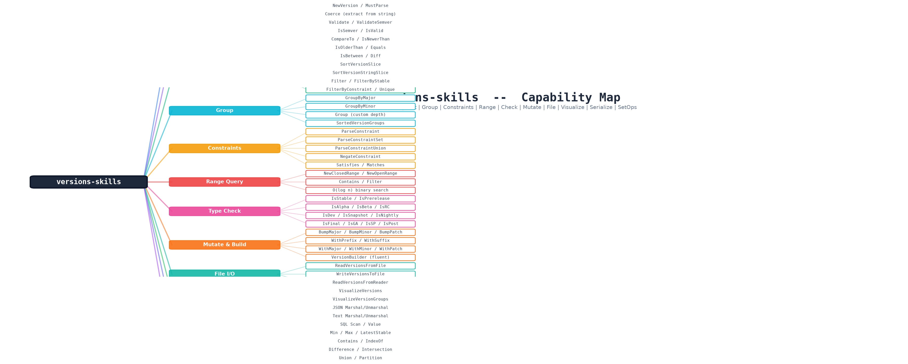
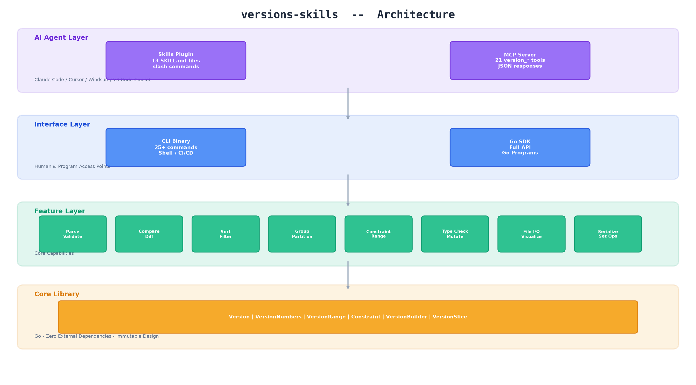
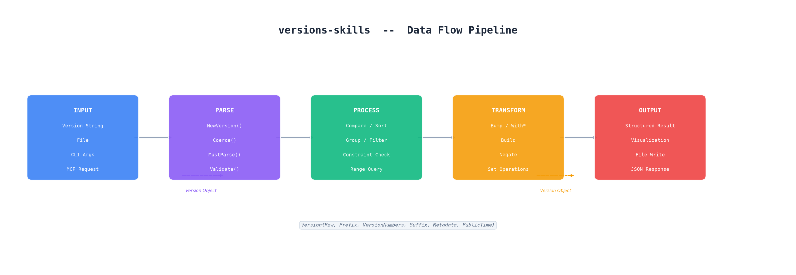
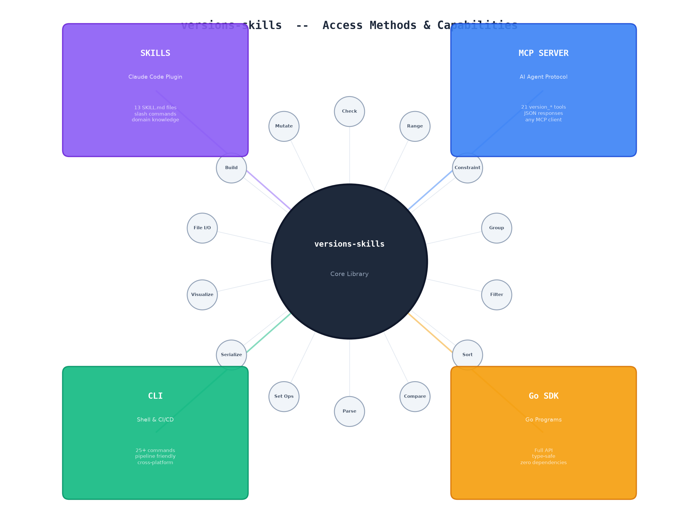
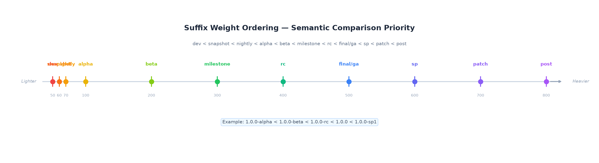
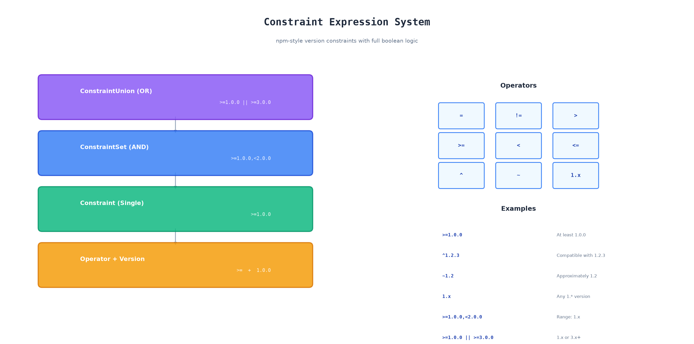

# Versions-Skills

<div align="center">

[](https://github.com/scagogogo/versions-skills/actions/workflows/go-test.yml)
[](https://goreportcard.com/report/github.com/scagogogo/versions-skills)
[](https://pkg.go.dev/github.com/scagogogo/versions-skills)
[](https://github.com/scagogogo/versions-skills/releases/latest)
[](https://opensource.org/licenses/MIT)

**A powerful version number parsing, comparison, sorting, grouping, and constraint checking library for Go**

Accessible via 🤖 **Skills** · 📦 **Go SDK** · 💻 **CLI** · 🔌 **MCP Server**

Works with **Claude Code**, **Cursor**, **Windsurf**, **VS Code Copilot**, and any MCP-compatible AI agent

[English](#features) · [简体中文](#功能特性)

</div>

---

## Capability Map

<div align="center">



*All capabilities of versions-skills — 12 functional domains, 3-level hierarchy from category to specific API*

</div>

---

## Architecture

<div align="center">



*Four-layer architecture: AI Agent → Interface → Feature → Core Library*

</div>

The original ASCII architecture diagram is also available in [中文版架构图](#ai-agent-集成架构) below.

**Two paths for AI agents:**
1. **Skills Plugin** — Claude Code reads `SKILL.md` files as domain knowledge, then calls CLI/MCP/SDK under the hood. Best for guided workflows and one-off tasks.
2. **MCP Server** — Any MCP-compatible client calls `version_*` tools directly. Best for programmatic use, batch operations, and non-Claude agents.

**Use both together** for the best experience — Skills provide the "how-to" knowledge, MCP provides the execution engine.

---

## Data Flow

<div align="center">



*Version strings flow through Input → Parse → Process → Transform → Output pipeline*

</div>

---

## Access Methods

<div align="center">



*Four access methods connecting to 14 core capabilities*

</div>

### 🤖 Skills (Claude Code) — Recommended for AI-powered workflows

**One command to install all 13 version skills as slash commands in Claude Code:**

```bash
# Step 1: Add the marketplace (one-time)
claude plugin marketplace add https://github.com/scagogogo/versions-skills

# Step 2: Install the plugin
claude plugin install versions
```

After installation, 13 slash commands are available in any Claude Code session:

| Command | What it does |
|:--------|:-------------|
| `/version-parsing` | Parse, validate, extract version components |
| `/version-comparison` | Compare versions, check ordering |
| `/version-sorting` | Sort version lists ascending/descending |
| `/version-grouping` | Group versions by major/minor numbers |
| `/version-constraints` | Parse and check constraint expressions |
| `/version-range-query` | Query versions within ranges |
| `/version-visualization` | Tree-based version hierarchy display |
| `/version-file-operations` | Read/write version lists from files |
| `/version-check` | Boolean type checks (IsBeta, IsStable, etc.) |
| `/version-mutation` | Bump versions, immutable modifications |
| `/version-properties` | Access segments, suffix weight, prefix |
| `/cli-operations` | Full CLI command reference |
| `/mcp-operations` | MCP server setup and tool reference |

> **How it works:** The plugin ships 13 `SKILL.md` files under `skills/`. Claude Code reads these as domain knowledge — when you type `/version-parsing`, Claude loads the skill's API reference, code examples, and decision tree, then uses the SDK/CLI/MCP to execute your request. No API key or runtime dependency needed; the skill tells Claude how to call the tools you already have installed.

<details>
<summary>📖 Plugin vs MCP Server — which should I use?</summary>

| | **Plugin (Skills)** | **MCP Server** |
|:--|:--|:--|
| **Install** | `claude plugin install versions` | `go install .../versions-mcp@latest` + config |
| **How it works** | Injects domain knowledge as slash commands | Exposes 21 tools as AI-callable functions |
| **Best for** | Guided workflows, learning the API, one-off tasks | Programmatic tool calls, batch operations, other AI agents |
| **Requires** | Claude Code | Any MCP-compatible client |
| **Use both?** | ✅ Yes — they complement each other | ✅ Yes — they complement each other |

</details>

### 📦 Go SDK — Recommended for Go developers

```bash
go get github.com/scagogogo/versions-skills
```

```go
import "github.com/scagogogo/versions-skills"

v := versions.NewVersion("v1.2.3-beta1")
fmt.Println(v.Major())    // 1
fmt.Println(v.IsValid())  // true
```

### 💻 CLI — Recommended for scripts and CI/CD

```bash
# One-line installer (Linux/macOS, auto-detects platform + version)
curl -sL https://raw.githubusercontent.com/scagogogo/versions-skills/main/install.sh | bash

# Or download a binary from GitHub Releases:
# https://github.com/scagogogo/versions-skills/releases/latest

# Or install via Go
go install github.com/scagogogo/versions-skills/cmd/versions@latest

# Usage
versions parse v1.2.3-beta1
versions compare 1.0.0 2.0.0
versions sort 3.0.0 1.0.0 2.0.0
```

### 🔌 MCP Server — Recommended for AI tool integration

The MCP server exposes all SDK capabilities as 21 AI-callable tools, compatible with **Claude Code**, **Cursor**, **Windsurf**, **VS Code Copilot**, and any MCP-compatible client.

```bash
go install github.com/scagogogo/versions-skills/cmd/versions-mcp@latest
```

<details>
<summary>⚙️ Configuration for each AI client</summary>

**Claude Code** — add to `~/.claude/settings.json` (user scope) or `.claude/settings.json` (project scope):

```json
{
  "mcpServers": {
    "versions": {
      "command": "versions-mcp",
      "args": ["--transport", "stdio"]
    }
  }
}
```

**Cursor** — add to `.cursor/mcp.json` in your project root:

```json
{
  "mcpServers": {
    "versions": {
      "command": "versions-mcp",
      "args": ["--transport", "stdio"]
    }
  }
}
```

**Windsurf** — add to `.windsurf/mcp.json` in your project root:

```json
{
  "mcpServers": {
    "versions": {
      "command": "versions-mcp",
      "args": ["--transport", "stdio"]
    }
  }
}
```

**VS Code (Copilot)** — add to `.vscode/mcp.json` in your project root:

```json
{
  "servers": {
    "versions": {
      "command": "versions-mcp",
      "args": ["--transport", "stdio"]
    }
  }
}
```

**Network mode (SSE)** — for shared/team deployments:

```bash
versions-mcp --transport sse --port 8080
```

Then point your client at `http://localhost:8080/sse`.

</details>

**Available tools:** `version_parse`, `version_validate`, `version_info`, `version_compare`, `version_sort`, `version_filter`, `version_group`, `version_range_query`, `version_constraint_check`, `version_min`, `version_max`, `version_latest_stable`, `version_latest_prerelease`, `version_unique`, `version_set_operation`, `version_build`, `version_bump`, `version_core`, `version_read_file`, `version_write_file`, `version_visualize`

---

## AI Agent Integration Architecture

```
┌─────────────────────────────────────────────────────────┐
│                    AI Agent / IDE                        │
│  (Claude Code · Cursor · Windsurf · VS Code Copilot)    │
├──────────────────────┬──────────────────────────────────┤
│                      │                                  │
│   🤖 Skills Plugin   │   🔌 MCP Server                  │
│   (Claude Code only) │   (any MCP client)               │
│                      │                                  │
│   13 SKILL.md files  │   21 version_* tools             │
│   → slash commands   │   → AI-callable functions         │
│   → domain knowledge │   → structured JSON responses     │
│                      │                                  │
├──────────────────────┴──────────────────────────────────┤
│                                                         │
│   💻 CLI binary          📦 Go SDK                      │
│   (shell/CI/CD)          (Go programs)                  │
│                                                         │
├─────────────────────────────────────────────────────────┤
│              Core Library (Go · zero dependencies)       │
└─────────────────────────────────────────────────────────┘
```

**Two paths for AI agents:**
1. **Skills Plugin** — Claude Code reads `SKILL.md` files as domain knowledge, then calls CLI/MCP/SDK under the hood. Best for guided workflows and one-off tasks.
2. **MCP Server** — Any MCP-compatible client calls `version_*` tools directly. Best for programmatic use, batch operations, and non-Claude agents.

**Use both together** for the best experience — Skills provide the "how-to" knowledge, MCP provides the execution engine.

---

## Features

- 🔄 **Comprehensive version support** — Standard semver (`1.2.3`), prefixed (`v1.2.3`), pre-release (`1.2.3-beta1`), and custom formats
- 🧩 **Flexible parsing** — Auto-detect prefix, numbers, suffix, and metadata with customizable delimiters
- 📊 **Version comparison** — Semantic-aware comparison with suffix weight ordering (dev < alpha < beta < rc < stable)
- 📦 **Grouping & sorting** — Group by major/minor version, sort with stable pre-release ordering
- 🔍 **Range queries** — Query versions within ranges with flexible boundary policies
- 📋 **Constraint expressions** — Full npm-style constraints: `>=1.0.0`, `^1.2.3`, `~1.2`, `1.x`, `>=1.0.0,<2.0.0 || >=3.0.0`
- 🏷️ **Semver compliance** — `IsSemver()`, `ValidateSemver()` for strict SemVer 2.0.0 validation
- 📁 **File I/O** — Read/write version lists from files with comment support
- 🌳 **Visualization** — Unicode tree-based version hierarchy display
- 🔧 **Immutable mutations** — `With*` methods and `Bump*` operations that never modify the original
- 🔗 **Serialization** — JSON, Text, SQL Scanner/Valuer out of the box
- 🚀 **Zero dependencies** — Core library has no external dependencies

<div align="center">



*Semantic comparison priority: suffix weight determines pre-release ordering*

</div>

---

## Quick Start

### Parse & Compare

```go
v1 := versions.NewVersion("1.2.3")
v2 := versions.NewVersion("v1.3.0-beta")

v1.IsOlderThan(v2)      // true
v2.IsPrerelease()       // true
v2.PreReleaseType()     // "beta"
v1.Diff(v2).IsUpgrade() // true
```

### Sort & Group

```go
list := versions.NewVersions("2.0.0", "1.0.0", "1.10.0", "1.5.0-beta")

// Sort
sorted := versions.SortVersionSlice(list)
// → [1.0.0, 1.5.0-beta, 1.10.0, 2.0.0]

// Group by major version
groups := versions.GroupByMajor(list)
// → {1: [1.0.0, 1.5.0-beta, 1.10.0], 2: [2.0.0]}
```

### Constraints

```go
v := versions.NewVersion("1.5.0")

// Check single constraint
c, _ := versions.ParseConstraint(">=1.0.0")
v.Satisfies(c)  // true

// Check constraint expression
ok, _ := v.Matches(">=1.0.0,<2.0.0")  // true

// Negate a constraint
neg := versions.NegateConstraint(c)  // <1.0.0
```

<div align="center">



*Three-level grammar: Union (OR) → Set (AND) → Single Constraint → Operator + Version*

</div>

### Range Queries

```go
low := versions.NewVersion("1.0.0")
high := versions.NewVersion("2.0.0")

r := versions.NewClosedRange(low, high)
r.Contains(versions.NewVersion("1.5.0"))  // true
r.Contains(versions.NewVersion("2.1.0"))  // false
```

### Extract from Strings

```go
v := versions.Coerce("program-1.2.3-linux-amd64")
fmt.Println(v.Raw)  // "1.2.3"
```

---

## API Overview

### Core Types

| Type | Description |
|:-----|:------------|
| `Version` | Represents a version with Raw, PublicTime, VersionNumbers, Prefix, Suffix, Metadata |
| `VersionNumbers` | `[]int` — the numeric segments of a version |
| `VersionPrefix` | `string` — the prefix before numbers (e.g. `"v"`) |
| `VersionSuffix` | `string` — the suffix after numbers (e.g. `"-beta1"`) |
| `VersionRange` | First-class version range with open/closed boundary support |
| `VersionDiff` | Structured difference between two versions |
| `VersionGroup` | Groups versions sharing the same numeric prefix |
| `SortedVersionGroups` | Pre-sorted version group collection for efficient range queries |
| `Constraint` | Single version constraint (operator + target version) |
| `ConstraintSet` | AND-combined constraints (e.g. `>=1.0.0,<2.0.0`) |
| `ConstraintUnion` | OR-combined constraint sets (e.g. `>=1.0.0 || >=3.0.0`) |
| `VersionBuilder` | Fluent builder for constructing Version objects |
| `VersionSlice` | `[]*Version` implementing `sort.Interface` with utility methods |
| `SuffixWeight` | Semantic weight enum for suffix ordering |

### Key Functions

| Category | Functions |
|:---------|:----------|
| **Parse** | `NewVersion`, `NewVersionE`, `MustParse`, `NewVersions`, `Coerce`, `CoerceE` |
| **Compare** | `CompareTo`, `IsNewerThan`, `IsOlderThan`, `Equals`, `IsBetween`, `Diff` |
| **Sort** | `SortVersionSlice`, `SortVersionStringSlice`, `VersionSlice.Sort()` |
| **Group** | `Group`, `GroupByMajor`, `GroupByMinor`, `NewSortedVersionGroups` |
| **Filter** | `Filter`, `FilterByConstraint`, `FilterByStable`, `FilterByMajor`, `Unique` |
| **Constraint** | `ParseConstraint`, `ParseConstraintSet`, `ParseConstraintUnion`, `NegateConstraint` |
| **Range** | `NewClosedRange`, `NewOpenRange`, `VersionRange.Contains`, `VersionRange.Filter` |
| **Check** | `IsPrerelease`, `IsStable`, `IsSemver`, `ValidateSemver`, `PreReleaseType` |
| **Mutate** | `BumpMajor`, `BumpMinor`, `BumpPatch`, `WithPrefix`, `WithSuffix`, `WithMajor`, `Increment` |
| **Utils** | `Min`, `Max`, `LatestStable`, `ContainsVersion`, `IndexOf`, `Difference`, `Intersection`, `Union`, `Partition` |
| **File** | `ReadVersionsFromFile`, `WriteVersionsToFile`, `ReadVersionsFromReader` |
| **Visualize** | `VisualizeVersions`, `VisualizeVersionGroups` |
| **Serialize** | `MarshalJSON`, `UnmarshalJSON`, `MarshalText`, `UnmarshalText`, `Scan`, `Value` |

### Version Methods (full list)

```
IsValid, IsZero, IsPrerelease, IsStable, IsDev, IsAlpha, IsBeta, IsRC,
IsSnapshot, IsMilestone, IsNightly, IsFinal, IsGA, IsPre, IsRelease,
IsSP, IsPost, IsSemver, IsNewerThan, IsOlderThan, Equals, IsBetween,
Satisfies, Matches, CompareTo, Major, Minor, Patch, SubVersion,
SuffixWeight, PreReleaseType, BuildGroupID, Segments, Segments64,
Core, Clone, Validate, ValidateSemver, Diff, Hash, Canonical, Format,
Increment, RawString, String, BumpMajor, BumpMinor, BumpPatch,
WithPrefix, WithSuffix, WithMajor, WithMinor, WithPatch,
WithNumbers, WithPublicTime, WithMetadata,
MarshalText, UnmarshalText, MarshalJSON, UnmarshalJSON, Scan, Value
```

---

## CLI Reference

```bash
# Parsing & Validation
versions parse v1.2.3-rc1
versions validate 1.2.3
versions info v1.2.3-beta1

# Comparison & Checks
versions compare 1.0.0 2.0.0
versions check --stable 1.2.3
versions check --beta 1.2.3-beta1
versions check --newer 1.0.0 1.5.0

# Sorting & Filtering
versions sort 3.0.0 1.0.0 2.0.0
versions sort --desc 3.0.0 1.0.0 2.0.0
versions filter --stable 1.0.0-alpha 1.0.0 2.0.0-beta 2.0.0
versions filter --constraint ">=1.0.0,<2.0.0" 0.5.0 1.0.0 1.5.0 2.0.0

# Grouping & Range
versions group 1.0.0 1.1.0 2.0.0
versions range 1.0.0 2.0.0 1.0.0 1.5.0 2.0.0 3.0.0

# Constraints
versions satisfies 1.5.0 ">=1.0.0,<2.0.0"

# Min/Max
versions min 3.0.0 1.0.0 2.0.0
versions max 3.0.0 1.0.0 2.0.0
versions latest-stable 1.0.0-alpha 1.0.0 2.0.0

# Construction & Mutation
versions build --prefix v --major 1 --minor 2 --patch 3
versions bump 1.2.3 --patch
versions core 1.2.3-beta

# File I/O
versions read versions.txt
versions write output.txt 1.0.0 2.0.0 3.0.0

# Visualization
versions visualize 1.0.0 1.1.0 2.0.0 --groups
```

---

## Installation

### Skills (Claude Code Plugin)

```bash
# Add marketplace (one-time)
claude plugin marketplace add https://github.com/scagogogo/versions-skills

# Install the plugin
claude plugin install versions
```

> After installation, 13 slash commands are available in Claude Code. See [🤖 Skills](#-skills-claude-code--recommended-for-ai-powered-workflows) above for the full list.

### MCP Server (for AI Agents)

The MCP server works with **Claude Code**, **Cursor**, **Windsurf**, **VS Code Copilot**, and any MCP-compatible client. See [🔌 MCP Server](#-mcp-server--recommended-for-ai-tool-integration) above for per-client configuration.

```bash
# Download binary from GitHub Releases
curl -sL https://github.com/scagogogo/versions-skills/releases/latest/download/versions-mcp_{VERSION}_linux_amd64.tar.gz | tar xz
chmod +x versions-mcp && sudo mv versions-mcp /usr/local/bin/

# Or install via Go
go install github.com/scagogogo/versions-skills/cmd/versions-mcp@latest
```

> `{VERSION}` is the release tag shown at the top of the [releases page](https://github.com/scagogogo/versions-skills/releases/latest).

### Go SDK

```bash
go get github.com/scagogogo/versions-skills
```

### CLI Binary

Pre-built binaries for **Linux**, **macOS**, **Windows**, **FreeBSD**, **OpenBSD**, and **NetBSD** on **amd64**, **arm64**, **arm**, **386**, **mips**, **mips64**, **mips64le**, **ppc64**, **ppc64le**, **s390x**, and **riscv64** architectures. Linux packages: **deb**, **rpm**, **apk**.

```bash
# One-line installer (auto-detects platform + version):
curl -sL https://raw.githubusercontent.com/scagogogo/versions-skills/main/install.sh | bash

# Or download a specific binary manually:
# Linux (amd64)
curl -sL https://github.com/scagogogo/versions-skills/releases/latest/download/versions_{VERSION}_linux_amd64.tar.gz | tar xz
chmod +x versions && sudo mv versions /usr/local/bin/

# macOS arm64 (Apple Silicon)
curl -sL https://github.com/scagogogo/versions-skills/releases/latest/download/versions_{VERSION}_darwin_arm64.tar.gz | tar xz
chmod +x versions && sudo mv versions /usr/local/bin/

# macOS amd64 (Intel)
curl -sL https://github.com/scagogogo/versions-skills/releases/latest/download/versions_{VERSION}_darwin_amd64.tar.gz | tar xz
chmod +x versions && sudo mv versions /usr/local/bin/

# Or install via package manager (Linux only):
# Debian/Ubuntu: dpkg -i versions_{VERSION}_linux_amd64.deb
# RHEL/Fedora:   rpm -i versions_{VERSION}_linux_amd64.rpm
# Alpine:        apk add versions_{VERSION}_linux_amd64.apk

# Or install via Go
go install github.com/scagogogo/versions-skills/cmd/versions@latest
```

> Prefer the one-line `install.sh` above, which resolves `{VERSION}` for you. For manual download, `{VERSION}` is the release tag shown at the top of the [releases page](https://github.com/scagogogo/versions-skills/releases/latest).

---

## Performance

- Version parsing: `O(n)` where n is the version string length
- Version comparison: `O(m)` where m is the max numeric segment count
- Version sorting: `O(n log n)` where n is the list length
- Range queries: `O(log n)` via sorted version groups with binary search

---

## License

[MIT License](./LICENSE) — Copyright © 2023-2026 scagogogo

---

## 功能特性

<div align="center">


*versions-skills 全部能力 — 12 个功能域，3 级层次从类别到具体 API*

</div>

<div align="center">

**一个强大的 Go 语言版本号解析、比较、排序、分组和约束检查库**

通过 🤖 **Skills** · 📦 **Go SDK** · 💻 **CLI** · 🔌 **MCP Server** 接入

兼容 **Claude Code**、**Cursor**、**Windsurf**、**VS Code Copilot** 及所有 MCP 兼容的 AI Agent

</div>

- 🔄 **全面的版本号支持** — 标准语义化版本（`1.2.3`）、带前缀（`v1.2.3`）、预发布（`1.2.3-beta1`）及自定义格式
- 🧩 **灵活的解析** — 自动识别前缀、数字部分、后缀和元数据，支持自定义分隔符
- 📊 **语义化比较** — 基于后缀权重排序（dev < alpha < beta < rc < stable）
- 📦 **分组与排序** — 按主/次版本号分组，支持稳定的预发布版本排序
- 🔍 **范围查询** — 支持灵活的边界包含/排除策略
- 📋 **约束表达式** — 完整的 npm 风格约束：`>=1.0.0`、`^1.2.3`、`~1.2`、`1.x`、`>=1.0.0,<2.0.0 || >=3.0.0`
- 🏷️ **Semver 规范** — `IsSemver()`、`ValidateSemver()` 严格遵循 SemVer 2.0.0
- 📁 **文件支持** — 从文件读取/写入版本号列表，支持注释
- 🌳 **可视化** — Unicode 树形版本层次结构展示
- 🔧 **不可变操作** — `With*` 和 `Bump*` 方法永不修改原始对象
- 🔗 **序列化** — 内置 JSON、Text、SQL Scanner/Valuer 支持
- 🚀 **零依赖** — 核心库无外部依赖

<div align="center">


*语义比较优先级：后缀权重决定预发布版本排序*

</div>

### AI Agent 集成架构

<div align="center">


*四层架构：AI Agent → 接口层 → 功能层 → 核心库*

</div>

**AI Agent 的两条路径：**
1. **Skills 插件** — Claude Code 读取 `SKILL.md` 文件作为领域知识，然后通过 CLI/MCP/SDK 执行。适合引导式工作流和一次性任务。
2. **MCP Server** — 任何 MCP 兼容客户端直接调用 `version_*` 工具。适合编程式调用、批量操作和非 Claude Agent。

**两者配合使用效果最佳** — Skills 提供"如何做"的知识，MCP 提供执行引擎。

<div align="center">


*版本号字符串通过 Input → Parse → Process → Transform → Output 管道流转*

</div>

<div align="center">


*三层语法：Union (OR) → Set (AND) → Single Constraint → Operator + Version*

</div>

### 接入方式

<div align="center">


*四种接入方式连接 14 个核心能力*

</div>

#### 🤖 Skills（Claude Code）— AI 工作流推荐

两步安装，获得 13 个版本操作斜杠命令：

```bash
# 第一步：添加 Marketplace（一次性）
claude plugin marketplace add https://github.com/scagogogo/versions-skills

# 第二步：安装插件
claude plugin install versions
```

安装后在 Claude Code 中使用斜杠命令：`/version-parsing`、`/version-comparison`、`/version-sorting` 等

> **原理：** 插件包含 13 个 `SKILL.md` 技能文件，Claude Code 将其加载为领域知识。输入 `/version-parsing` 时，Claude 会读取对应的 API 参考、代码示例和决策树，然后通过 SDK/CLI/MCP 执行你的请求。

#### 🔌 MCP Server（AI Agent 通用）— 支持 Claude Code / Cursor / Windsurf / VS Code Copilot

```bash
go install github.com/scagogogo/versions-skills/cmd/versions-mcp@latest
```

**Claude Code** — 添加到 `~/.claude/settings.json`：

```json
{
  "mcpServers": {
    "versions": {
      "command": "versions-mcp",
      "args": ["--transport", "stdio"]
    }
  }
}
```

**Cursor** — 添加到项目根目录 `.cursor/mcp.json`：

```json
{
  "mcpServers": {
    "versions": {
      "command": "versions-mcp",
      "args": ["--transport", "stdio"]
    }
  }
}
```

**Windsurf** — 添加到项目根目录 `.windsurf/mcp.json`：

```json
{
  "mcpServers": {
    "versions": {
      "command": "versions-mcp",
      "args": ["--transport", "stdio"]
    }
  }
}
```

**VS Code (Copilot)** — 添加到项目根目录 `.vscode/mcp.json`：

```json
{
  "servers": {
    "versions": {
      "command": "versions-mcp",
      "args": ["--transport", "stdio"]
    }
  }
}
```

#### 📦 Go SDK — Go 开发者推荐

```bash
go get github.com/scagogogo/versions-skills
```

#### 💻 CLI — 脚本和 CI/CD 推荐

从 [GitHub Releases](https://github.com/scagogogo/versions-skills/releases/latest) 下载，或：

```bash
go install github.com/scagogogo/versions-skills/cmd/versions@latest
```
