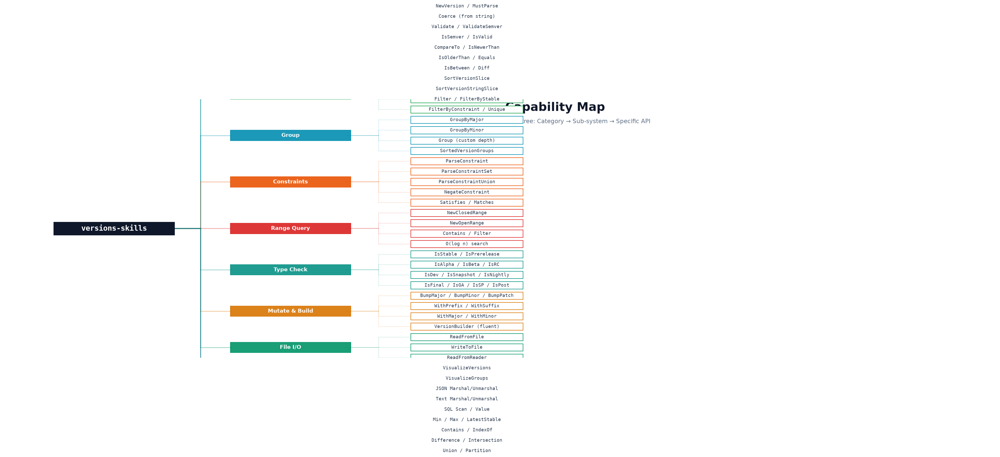
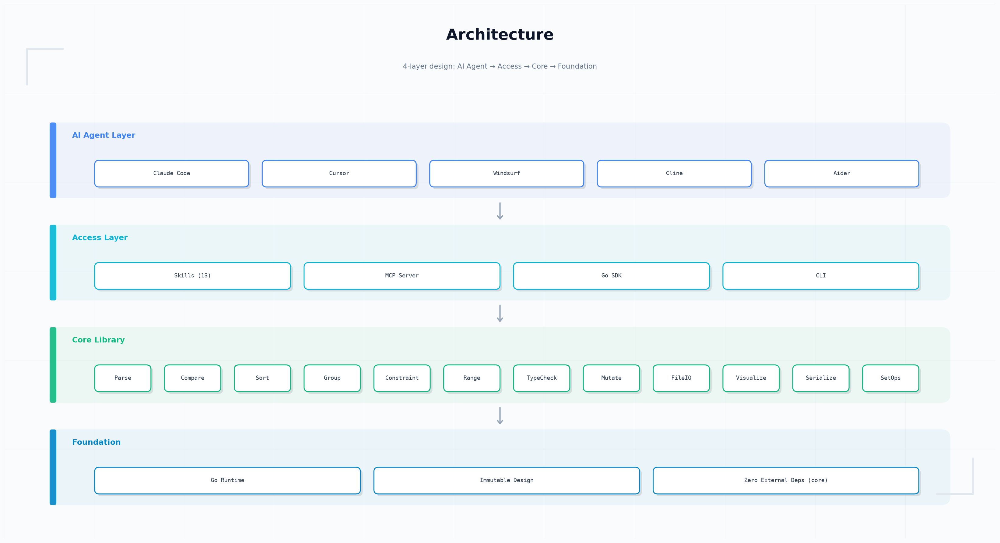
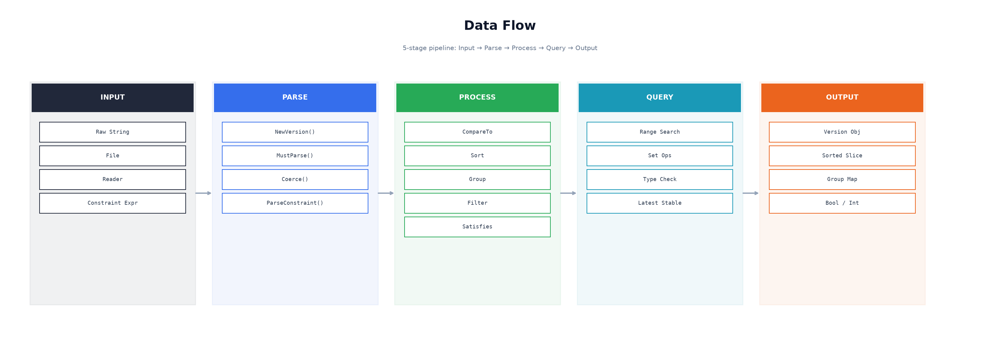
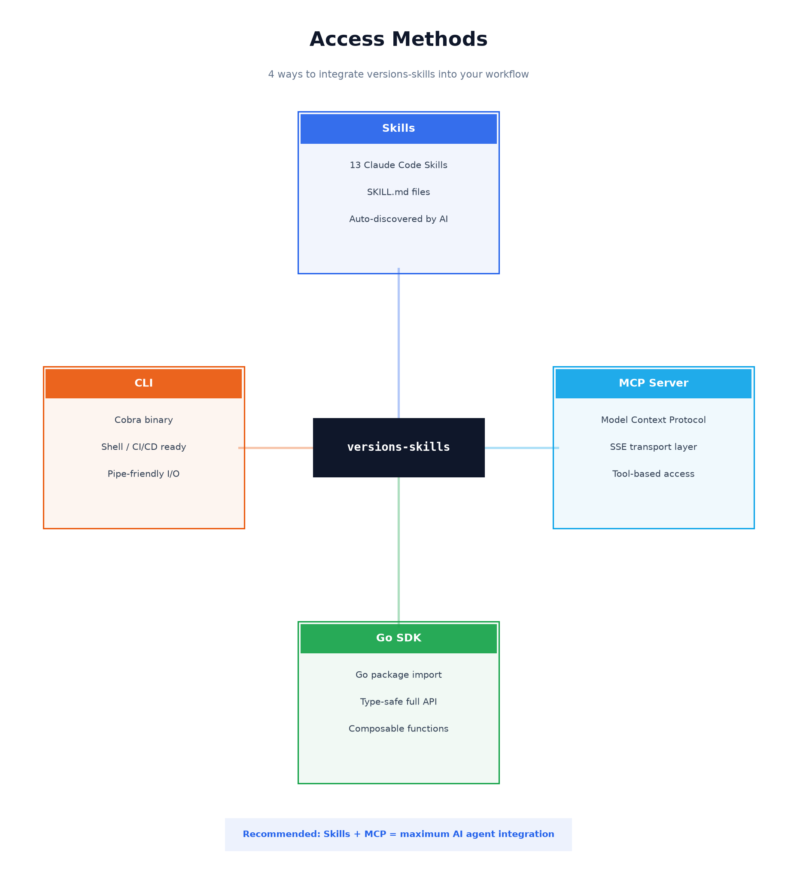
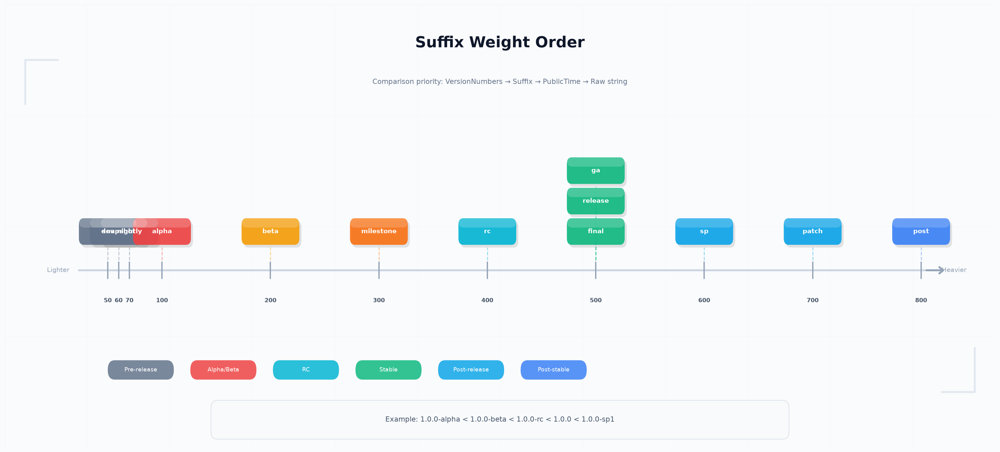
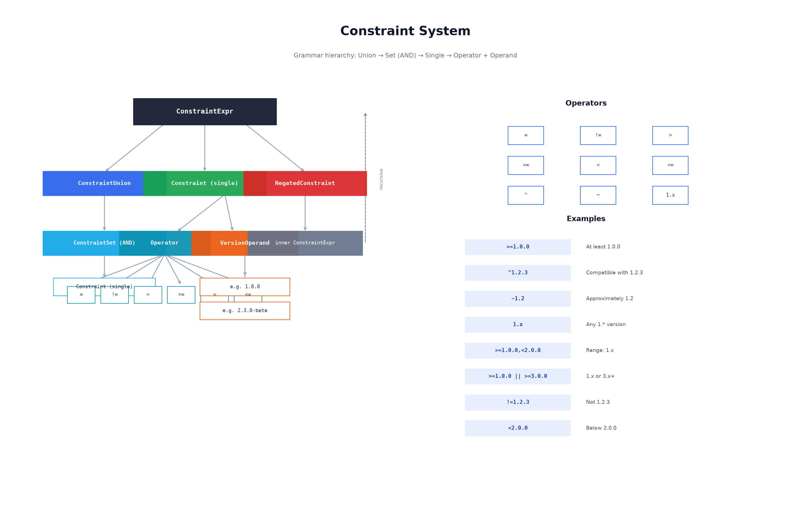

# Versions-Skills

<div align="center">

[](https://github.com/scagogogo/versions-skills/actions/workflows/go-test.yml)
[](https://goreportcard.com/report/github.com/scagogogo/versions-skills)
[](https://pkg.go.dev/github.com/scagogogo/versions-skills)
[](https://github.com/scagogogo/versions-skills/releases/latest)
[](https://opensource.org/licenses/MIT)

**An AI-native toolkit for version numbers — parse, compare, sort, group, and check constraints in Go**

Built for the agentic era: every capability is reachable through 🤖 **Claude Code Skills** and 🔌 **MCP** so that AI agents can call them directly, with a 📦 **Go SDK** and 💻 **CLI** underneath.

Works natively with **Claude Code**, **Codex**, **Cursor**, **Windsurf**, **Cline**, **VS Code Copilot**, and any MCP-compatible AI agent.

[Features](#features) · [AI Agent Integration](#ai-agent-integration-architecture) · [简体中文](#功能特性)

</div>

---

## Capability Map

<div align="center">



*All capabilities of versions-skills — 12 functional domains, 3-level hierarchy from category to specific API*

</div>

---

## Architecture

<div align="center">



*Four-layer architecture: AI Agent → Interface → Feature → Core Library*

</div>

The original ASCII architecture diagram is also available in [中文版架构图](#ai-agent-集成架构) below.

**Two paths for AI agents:**
1. **Skills Plugin** — Claude Code reads `SKILL.md` files as domain knowledge, then calls CLI/MCP/SDK under the hood. Best for guided workflows and one-off tasks.
2. **MCP Server** — Any MCP-compatible client calls `version_*` tools directly. Best for programmatic use, batch operations, and non-Claude agents.

**Use both together** for the best experience — Skills provide the "how-to" knowledge, MCP provides the execution engine.

---

## Data Flow

<div align="center">



*Version strings flow through Input → Parse → Process → Transform → Output pipeline*

</div>

---

## Access Methods

<div align="center">



*Four access methods connecting to 14 core capabilities*

</div>

### 🤖 Skills (Claude Code) — Recommended for AI-powered workflows

**One command to install all 13 version skills as slash commands in Claude Code:**

```bash
# Step 1: Add the marketplace (one-time)
claude plugin marketplace add https://github.com/scagogogo/versions-skills

# Step 2: Install the plugin
claude plugin install versions
```

After installation, 13 slash commands are available in any Claude Code session:

| Command | What it does |
|:--------|:-------------|
| `/version-parsing` | Parse, validate, extract version components |
| `/version-comparison` | Compare versions, check ordering |
| `/version-sorting` | Sort version lists ascending/descending |
| `/version-grouping` | Group versions by major/minor numbers |
| `/version-constraints` | Parse and check constraint expressions |
| `/version-range-query` | Query versions within ranges |
| `/version-visualization` | Tree-based version hierarchy display |
| `/version-file-operations` | Read/write version lists from files |
| `/version-check` | Boolean type checks (IsBeta, IsStable, etc.) |
| `/version-mutation` | Bump versions, immutable modifications |
| `/version-properties` | Access segments, suffix weight, prefix |
| `/cli-operations` | Full CLI command reference |
| `/mcp-operations` | MCP server setup and tool reference |

> **How it works:** The plugin ships 13 `SKILL.md` files under `skills/`. Claude Code reads these as domain knowledge — when you type `/version-parsing`, Claude loads the skill's API reference, code examples, and decision tree, then uses the SDK/CLI/MCP to execute your request. No API key or runtime dependency needed; the skill tells Claude how to call the tools you already have installed.

<details>
<summary>📖 Plugin vs MCP Server — which should I use?</summary>

| | **Plugin (Skills)** | **MCP Server** |
|:--|:--|:--|
| **Install** | `claude plugin install versions` | `go install .../versions-mcp@latest` + config |
| **How it works** | Injects domain knowledge as slash commands | Exposes 21 tools as AI-callable functions |
| **Best for** | Guided workflows, learning the API, one-off tasks | Programmatic tool calls, batch operations, other AI agents |
| **Requires** | Claude Code | Any MCP-compatible client |
| **Use both?** | ✅ Yes — they complement each other | ✅ Yes — they complement each other |

</details>

### 📦 Go SDK — Recommended for Go developers

```bash
go get github.com/scagogogo/versions-skills
```

```go
import "github.com/scagogogo/versions-skills"

v := versions.NewVersion("v1.2.3-beta1")
fmt.Println(v.Major())    // 1
fmt.Println(v.IsValid())  // true
```

### 💻 CLI — Recommended for scripts and CI/CD

```bash
# One-line installer (Linux/macOS, auto-detects platform + version)
curl -sL https://raw.githubusercontent.com/scagogogo/versions-skills/main/install.sh | bash

# Or download a binary from GitHub Releases:
# https://github.com/scagogogo/versions-skills/releases/latest

# Or install via Go
go install github.com/scagogogo/versions-skills/cmd/versions@latest

# Usage
versions parse v1.2.3-beta1
versions compare 1.0.0 2.0.0
versions sort 3.0.0 1.0.0 2.0.0
```

### 🔌 MCP Server — Recommended for AI tool integration

The MCP server exposes all SDK capabilities as 21 AI-callable tools, compatible with **Claude Code**, **Codex**, **Cursor**, **Windsurf**, **Cline**, **VS Code Copilot**, and any MCP-compatible client.

```bash
go install github.com/scagogogo/versions-skills/cmd/versions-mcp@latest
```

<details>
<summary>⚙️ Configuration for each AI client</summary>

**Claude Code** — add to `~/.claude/settings.json` (user scope) or `.claude/settings.json` (project scope):

```json
{
  "mcpServers": {
    "versions": {
      "command": "versions-mcp",
      "args": ["--transport", "stdio"]
    }
  }
}
```

**Cursor** — add to `.cursor/mcp.json` in your project root:

```json
{
  "mcpServers": {
    "versions": {
      "command": "versions-mcp",
      "args": ["--transport", "stdio"]
    }
  }
}
```

**Windsurf** — add to `.windsurf/mcp.json` in your project root:

```json
{
  "mcpServers": {
    "versions": {
      "command": "versions-mcp",
      "args": ["--transport", "stdio"]
    }
  }
}
```

**VS Code (Copilot)** — add to `.vscode/mcp.json` in your project root:

```json
{
  "servers": {
    "versions": {
      "command": "versions-mcp",
      "args": ["--transport", "stdio"]
    }
  }
}
```

**Codex (OpenAI CLI)** — register with the `codex mcp` command (writes to `~/.codex/config.toml`):

```bash
codex mcp add versions -- versions-mcp --transport stdio
```

Or edit `~/.codex/config.toml` directly:

```toml
[mcp_servers.versions]
command = "versions-mcp"
args = ["--transport", "stdio"]
```

> In Codex, the server appears as the `versions` MCP server. Start a session with `codex` and the `version_*` tools are available to the agent automatically.

**Cline (VS Code)** — add to `~/.cline/cline_mcp_settings.json` (or via the Cline UI → *MCP Servers → + Add Server*):

```json
{
  "mcpServers": {
    "versions": {
      "command": "versions-mcp",
      "args": ["--transport", "stdio"],
      "disabled": false,
      "autoApprove": []
    }
  }
}
```

**Network mode (SSE)** — for shared/team deployments:

```bash
versions-mcp --transport sse --port 8080
```

Then point any MCP client at `http://localhost:8080/sse` (use the SSE/HTTP transport option in your client's config instead of a `command`).

</details>

> **Don't see your client?** Any tool that speaks MCP can connect — point its stdio command at `versions-mcp --transport stdio`, or its HTTP transport at the SSE endpoint above. See the [AI Agent Integration](#ai-agent-integration-architecture) section for the decision table.

**Available tools:** `version_parse`, `version_validate`, `version_info`, `version_compare`, `version_sort`, `version_filter`, `version_group`, `version_range_query`, `version_constraint_check`, `version_min`, `version_max`, `version_latest_stable`, `version_latest_prerelease`, `version_unique`, `version_set_operation`, `version_build`, `version_bump`, `version_core`, `version_read_file`, `version_write_file`, `version_visualize`

---

## AI Agent Integration Architecture

```
┌─────────────────────────────────────────────────────────┐
│                    AI Agent / IDE                        │
│  (Claude Code · Codex · Cursor · Windsurf · Cline · …) │
├──────────────────────┬──────────────────────────────────┤
│                      │                                  │
│   🤖 Skills Plugin   │   🔌 MCP Server                  │
│   (Claude Code only) │   (any MCP client)               │
│                      │                                  │
│   13 SKILL.md files  │   21 version_* tools             │
│   → slash commands   │   → AI-callable functions         │
│   → domain knowledge │   → structured JSON responses     │
│                      │                                  │
├──────────────────────┴──────────────────────────────────┤
│                                                         │
│   💻 CLI binary          📦 Go SDK                      │
│   (shell/CI/CD)          (Go programs)                  │
│                                                         │
├─────────────────────────────────────────────────────────┤
│              Core Library (Go · zero dependencies)       │
└─────────────────────────────────────────────────────────┘
```

**Two paths for AI agents:**
1. **Skills Plugin** — Claude Code reads `SKILL.md` files as domain knowledge, then calls CLI/MCP/SDK under the hood. Best for guided workflows and one-off tasks.
2. **MCP Server** — Any MCP-compatible client calls `version_*` tools directly. Best for programmatic use, batch operations, and non-Claude agents.

**Use both together** for the best experience — Skills provide the "how-to" knowledge, MCP provides the execution engine.

### Which agent, which path?

| AI Agent / IDE | Skills | MCP (stdio) | MCP (SSE) | Config location |
|:--|:--:|:--:|:--:|:--|
| **Claude Code** | ✅ `claude plugin install versions` | ✅ | ✅ | `~/.claude/settings.json` |
| **Codex** (OpenAI CLI) | — | ✅ | ✅ | `~/.codex/config.toml` (or `codex mcp add`) |
| **Cursor** | — | ✅ | ✅ | `.cursor/mcp.json` |
| **Windsurf** | — | ✅ | ✅ | `.windsurf/mcp.json` |
| **Cline** (VS Code) | — | ✅ | ✅ | `~/.cline/cline_mcp_settings.json` |
| **VS Code Copilot** | — | ✅ | ✅ | `.vscode/mcp.json` |
| *Any MCP client* | — | ✅ | ✅ | client-specific |

> **Recommendation:** On Claude Code, install **both** the Skills plugin and the MCP server — the plugin gives Claude the versioning domain knowledge (when to use constraints vs. ranges, how suffixes sort), while MCP gives it a fast, structured execution channel. On every other agent, the MCP server is the only path you need.

### Quick start by agent

**Claude Code** — get the slash commands *and* the MCP tools:

```bash
# 1. Domain knowledge as 13 slash commands
claude plugin marketplace add https://github.com/scagogogo/versions-skills
claude plugin install versions

# 2. Direct tool execution (optional but recommended)
claude mcp add versions -- versions-mcp --transport stdio
```

Now you can either type `/version-sorting` to be guided through it, or just ask "sort these versions" and Claude will call `version_sort` directly.

**Codex** (OpenAI CLI):

```bash
# Install the binary once
go install github.com/scagogogo/versions-skills/cmd/versions-mcp@latest

# Register with Codex
codex mcp add versions -- versions-mcp --transport stdio
```

**Cursor / Windsurf / VS Code Copilot / Cline** — install the binary, then add the JSON snippet from the [🔌 MCP Server](#-mcp-server--recommended-for-ai-tool-integration) section to the config file listed in the table above.

---

## Features

- 🔄 **Comprehensive version support** — Standard semver (`1.2.3`), prefixed (`v1.2.3`), pre-release (`1.2.3-beta1`), and custom formats
- 🧩 **Flexible parsing** — Auto-detect prefix, numbers, suffix, and metadata with customizable delimiters
- 📊 **Version comparison** — Semantic-aware comparison with suffix weight ordering (dev < alpha < beta < rc < stable)
- 📦 **Grouping & sorting** — Group by major/minor version, sort with stable pre-release ordering
- 🔍 **Range queries** — Query versions within ranges with flexible boundary policies
- 📋 **Constraint expressions** — Full npm-style constraints: `>=1.0.0`, `^1.2.3`, `~1.2`, `1.x`, `>=1.0.0,<2.0.0 || >=3.0.0`
- 🏷️ **Semver compliance** — `IsSemver()`, `ValidateSemver()` for strict SemVer 2.0.0 validation
- 📁 **File I/O** — Read/write version lists from files with comment support
- 🌳 **Visualization** — Unicode tree-based version hierarchy display
- 🔧 **Immutable mutations** — `With*` methods and `Bump*` operations that never modify the original
- 🔗 **Serialization** — JSON, Text, SQL Scanner/Valuer out of the box
- 🚀 **Zero dependencies** — Core library has no external dependencies

<div align="center">



*Semantic comparison priority: suffix weight determines pre-release ordering*

</div>

---

## Quick Start

### Parse & Compare

```go
v1 := versions.NewVersion("1.2.3")
v2 := versions.NewVersion("v1.3.0-beta")

v1.IsOlderThan(v2)      // true
v2.IsPrerelease()       // true
v2.PreReleaseType()     // "beta"
v1.Diff(v2).IsUpgrade() // true
```

### Sort & Group

```go
list := versions.NewVersions("2.0.0", "1.0.0", "1.10.0", "1.5.0-beta")

// Sort
sorted := versions.SortVersionSlice(list)
// → [1.0.0, 1.5.0-beta, 1.10.0, 2.0.0]

// Group by major version
groups := versions.GroupByMajor(list)
// → {1: [1.0.0, 1.5.0-beta, 1.10.0], 2: [2.0.0]}
```

### Constraints

```go
v := versions.NewVersion("1.5.0")

// Check single constraint
c, _ := versions.ParseConstraint(">=1.0.0")
v.Satisfies(c)  // true

// Check constraint expression
ok, _ := v.Matches(">=1.0.0,<2.0.0")  // true

// Negate a constraint
neg := versions.NegateConstraint(c)  // <1.0.0
```

<div align="center">



*Three-level grammar: Union (OR) → Set (AND) → Single Constraint → Operator + Version*

</div>

### Range Queries

```go
low := versions.NewVersion("1.0.0")
high := versions.NewVersion("2.0.0")

r := versions.NewClosedRange(low, high)
r.Contains(versions.NewVersion("1.5.0"))  // true
r.Contains(versions.NewVersion("2.1.0"))  // false
```

### Extract from Strings

```go
v := versions.Coerce("program-1.2.3-linux-amd64")
fmt.Println(v.Raw)  // "1.2.3"
```

---

## How the Algorithms Work

This section documents the exact semantics an AI agent (or human) needs to predict library behavior without reading source. Every rule below is implemented in the referenced source file.

### 1. Parsing — three segments + metadata (`parser.go`)

Every version string is split into four fields:

```
 v1.2.3-beta1+build.7
 │ └─┬─┘ └──┬──┘ └──┬──┘
 │  │      │       └─ Metadata   (semver build metadata, after "+")
 │  │      └─ Suffix             (everything after the numeric part)
 │  └─ VersionNumbers            (the integer segments, dot-delimited)
 └─ Prefix                       (non-digit lead-in, e.g. "v", "release-")
```

Algorithm, in order:

1. **Trim** whitespace. Empty string → invalid version with empty `VersionNumbers`.
2. **Strip metadata**: find the last `+`. The text after it is metadata **only if it contains no `-`** — so `0.9.0+121-bcc5decc` keeps `121-bcc5decc` as part of the suffix (Scala/Maven style), while `1.2.3+build.7` strips `build.7` into `Metadata`. This disambiguates semver metadata from pre-release identifiers that legitimately contain `-`.
3. **Pure-alpha shortcut**: if the remaining string has no digit at all, the whole thing becomes `Prefix` and `VersionNumbers` is empty (an invalid version, e.g. `"abc"`).
4. **Read prefix**: scan to the first digit; everything before it is the prefix. `v1.2.3` → prefix `"v"`. `.1` → prefix `""`.
5. **Read numbers**: from the first digit, collect digit-runs separated by the configured delimiter (default `.`). Consecutive delimiters collapse; parsing stops at the first non-digit, non-delimiter char. `1.2.48` → `[1,2,48]`.
6. **Read suffix**: everything after the last number-position. A regex cascade handles common patterns (`-snapshot.…`, `-v2.x.x`, `-revN-…`, `+nnn-xxxx`, `-beta1`) before falling back to "remainder of the string."

`Coerce(s)` does the same but first extracts a version-shaped substring out of arbitrary text (`"program-1.2.3-linux-amd64"` → `"1.2.3"`).

> **Delimiters are unifiable**: parsing respects a configurable `Delimiters` option, but `VersionNumbers.BuildGroupID()` always rejoins with `.` — so `"1/2/3"` and `"1.2.3"` produce the same canonical numeric form.

### 2. Comparison — four-level priority (`version.go: CompareTo`)

`a.CompareTo(b)` returns `-1/0/1` by trying these keys in order; the **first that differs wins**:

| # | Key | Rule | Source |
|:--:|:--|:--|:--|
| 1 | **VersionNumbers** | Element-wise `int` compare left→right; if all shared positions tie, the **longer** one is greater (`1.2` < `1.2.0`? — see note). | `version_numbers.go` |
| 2 | **Suffix** | Stable (no suffix) **beats** pre-release (has suffix): `1.0.0` > `1.0.0-rc`. Two suffixes compared by [suffix weight](#3-suffix-weight-ordering-suffix_weightgo). | `version.go` / `version_suffix.go` |
| 3 | **PublicTime** | If both have a non-zero `PublicTime`, later wins. Only consulted when numbers + suffix both tie. | `version.go` |
| 4 | **Raw string** | Final tiebreaker: lexicographic on the original string. | `version.go` |

> **Note on length:** `VersionNumbers.CompareTo` treats `1.2` as **less than** `1.2.0` (shorter is smaller when shared segments tie). In practice this means a 2-segment version sorts below its 3-segment sibling — be explicit with `1.2.0` if you mean the release.

This ordering is why `1.0.0-alpha` < `1.0.0-beta` < `1.0.0-rc1` < `1.0.0` < `1.0.0-post1`, matching real release ladders rather than naive ASCII order.

### 3. Suffix weight ordering (`suffix_weight.go`)

Each suffix is matched (case-insensitive, optional leading `-`/`.`) against an ordered pattern table. The matched **weight** determines its rank; if both suffixes have the same weight, their trailing integer (the "sub-version", e.g. the `1` in `-alpha1`) breaks the tie.

| Weight | Suffix patterns (examples) | Meaning |
|-------:|:--|:--|
| 50 | `dev`, `dev1`, `.dev.2` | Development build |
| 60 | `snapshot`, `snapshot20201012…` | Snapshot |
| 70 | `nightly` | Nightly build |
| 100 | `a`, `alpha`, `alpha1`, `.alpha.2` | Alpha |
| 200 | `b`, `beta`, `beta2` | Beta |
| 300 | `m`, `milestone`, `m1` | Milestone |
| 400 | `rc`, `rc1` | Release candidate |
| 410 | `pre`, `pre1` | Pre-release |
| 420 | `cr`, `cr1` | CR variant of RC |
| 500 | `final`, `release`, `ga` | Release / GA (same as *no suffix*) |
| 600 | `sp`, `sp1` | Service pack |
| 700 | `patch`, `patch1` | Patch |
| 800 | `post`, `post1` | Post-release (PEP 440) |

Rules worth knowing:
- **Unknown suffixes sort after known ones** within the same comparison — a suffix that matches no pattern is treated as less important than any recognized pre-release type but falls back to plain string order among themselves.
- `final`, `release`, `ga` all share weight 500 — identical in sort order to having no suffix at all, but `IsStable()` only returns true when the suffix is *literally empty*. A version `1.0.0-ga` is release-weighted but not "stable" by the empty-suffix test.

### 4. Constraint grammar — three levels (`constraint.go`)

```
Union  (OR)   : ">1.0.0,<2.0.0 || >=3.0.0"     ← split on "||"
  └─ Set (AND) : ">=1.0.0,<2.0.0"              ← split on ","
       └─ Single: ">=1.0.0" | "^1.2.3" | "~1.2" | "1.x" | "1.2.3"
```

`ConstraintUnion.Match(v)` = true if **any** set matches. `ConstraintSet.Match(v)` = true if **all** singles match. A single `Constraint` is `Operator + Version`.

Supported operators and their exact semantics (all comparisons use `Version.CompareTo`, so suffix weights apply):

| Op | Name | `base` | matches `v` when |
|:--:|:--|:--|:--|
| `=` | equal | `1.2.3` | `v == 1.2.3` (bare `1.2.3` means `=`) |
| `!=` | not equal | `1.2.3` | `v != 1.2.3` |
| `>` `<` `>=` `<=` | range comparison | `1.2.3` | straightforward `CompareTo` |
| `^` | caret | `^1.2.3` | `v >= 1.2.3` AND `v < {first-non-zero-segment+1, 0…}` |
| `~` | tilde | `~1.2.3` | `v >= 1.2.3` AND `v < {major, minor+1, 0…}` |
| `x`/`X`/`*` | wildcard | `1.x` | `v >= 1.0.0` AND `v < {last-non-zero+1, 0…}` |

**Caret bounds** (compatibility range — "leftmost non-zero"):
- `^1.2.3` → `>=1.2.3, <2.0.0` (bump the `1`)
- `^0.2.3` → `>=0.2.3, <0.3.0` (first non-zero is the minor)
- `^0.0.3` → `>=0.0.3, <0.0.4` (first non-zero is the patch)

**Tilde bounds** (lock to minor):
- `~1.2.3` → `>=1.2.3, <1.3.0`
- `~1.2`   → `>=1.2.0, <1.3.0` (patch is open)

**Wildcard bounds** (bump the last specified digit):
- `1.x`   → `>=1.0.0, <2.0.0`
- `1.2.x` → `>=1.2.0, <1.3.0`

### 5. Range queries — open/closed boundaries (`version_range.go`)

`VersionRange{Low, High, LowInclusive, HighInclusive}` tests membership with four boundary checks:

- `Low == nil` → no lower bound; `High == nil` → no upper bound.
- On the low side: `v < Low` fails; `v == Low && !LowInclusive` fails (excludes the endpoint of an open interval).
- Symmetric on the high side.

So `NewClosedRange(1.0.0, 2.0.0)` = `[1.0.0, 2.0.0]` (both endpoints in), `NewOpenRange` = `(1.0.0, 2.0.0)` (both out), and you can mix: `NewVersionRange(1.0.0, 2.0.0, true, false)` = `[1.0.0, 2.0.0)`. `IsEmpty()` detects a degenerate range where `Low > High`, or where `Low == High` but at least one side is open.

### 6. Sorting & grouping — two-phase, group-aware (`sort.go`, `version_group.go`)

`SortVersionSlice` is **not** a flat `sort.Slice`. It runs two phases:

1. **Group** all versions by `BuildGroupID()` (the full numeric string, e.g. `1.2.3`).
2. **Sort groups** by their numeric prefix (`VersionGroup.CompareTo`), then **sort within each group** and concatenate.

The payoff: `1.10.0` correctly sorts *after* `1.2.0` (numeric, not string), and versions of the same lineage stay clustered.

**Group granularity — two different APIs, don't confuse them:**

| Function | Groups by | Key type | Example buckets |
|:--|:--|:--|:--|
| `Group(versions)` | **full numeric string** (`BuildGroupID`) | `map[string]*VersionGroup` | `1.2.3` and `1.2.4` land in **different** groups (`"1.2.3"`, `"1.2.4"`) |
| `GroupByMajor(versions)` | **major segment only** (`Major()`) | `map[int][]*Version` | `1.2.3`, `1.2.4`, `1.9.0` all in group `1` |
| `GroupByMinor(versions)` | **major.minor** | `map[string][]*Version` | `1.2.3`, `1.2.4` in group `"1.2"` |

`Group()` is what sorting and range queries use internally; `GroupByMajor`/`GroupByMinor` are convenience buckets for "give me everything in the 1.x line".

### 7. Range queries over a sorted index — `SortedVersionGroups` (`sorted_version_groups.go`)

For repeated range queries over a large version set, build a `SortedVersionGroups` once:

```go
sg := versions.NewSortedVersionGroups(allVersions)   // group + sort + index, O(n log n)
start := tuple.NewTuple2(versions.NewVersion("1.0.0"), versions.ContainsPolicyYes)
end   := tuple.NewTuple2(versions.NewVersion("2.0.0"), versions.ContainsPolicyNo)
hits  := sg.QueryRange(start, end)                    // O(groups) scan with index jump
```

It pre-sorts groups and builds a `groupID → index` map. `QueryRange` jumps straight to the start group via the map (skipping everything below it), then walks groups collecting `QueryRangeVersions` until it passes the end. The `ContainsPolicy` on each tuple decides whether the boundary version itself is included (`Yes`) or excluded (`No`). This is the engine behind `version_range_query` and is far cheaper than re-filtering the whole list per query.

---

## API Overview

### Core Types

| Type | Description |
|:-----|:------------|
| `Version` | Represents a version with Raw, PublicTime, VersionNumbers, Prefix, Suffix, Metadata |
| `VersionNumbers` | `[]int` — the numeric segments of a version |
| `VersionPrefix` | `string` — the prefix before numbers (e.g. `"v"`) |
| `VersionSuffix` | `string` — the suffix after numbers (e.g. `"-beta1"`) |
| `VersionRange` | First-class version range with open/closed boundary support |
| `VersionDiff` | Structured difference between two versions |
| `VersionGroup` | Groups versions sharing the same numeric prefix |
| `SortedVersionGroups` | Pre-sorted version group collection for efficient range queries |
| `Constraint` | Single version constraint (operator + target version) |
| `ConstraintSet` | AND-combined constraints (e.g. `>=1.0.0,<2.0.0`) |
| `ConstraintUnion` | OR-combined constraint sets (e.g. `>=1.0.0 || >=3.0.0`) |
| `VersionBuilder` | Fluent builder for constructing Version objects |
| `VersionSlice` | `[]*Version` implementing `sort.Interface` with utility methods |
| `SuffixWeight` | Semantic weight enum for suffix ordering |

### Key Functions

| Category | Functions |
|:---------|:----------|
| **Parse** | `NewVersion`, `NewVersionE`, `MustParse`, `NewVersions`, `Coerce`, `CoerceE` |
| **Compare** | `CompareTo`, `IsNewerThan`, `IsOlderThan`, `Equals`, `IsBetween`, `Diff` |
| **Sort** | `SortVersionSlice`, `SortVersionStringSlice`, `VersionSlice.Sort()` |
| **Group** | `Group`, `GroupByMajor`, `GroupByMinor`, `NewSortedVersionGroups` |
| **Filter** | `Filter`, `FilterByConstraint`, `FilterByStable`, `FilterByMajor`, `Unique` |
| **Constraint** | `ParseConstraint`, `ParseConstraintSet`, `ParseConstraintUnion`, `NegateConstraint` |
| **Range** | `NewClosedRange`, `NewOpenRange`, `VersionRange.Contains`, `VersionRange.Filter` |
| **Check** | `IsPrerelease`, `IsStable`, `IsSemver`, `ValidateSemver`, `PreReleaseType` |
| **Mutate** | `BumpMajor`, `BumpMinor`, `BumpPatch`, `WithPrefix`, `WithSuffix`, `WithMajor`, `Increment` |
| **Utils** | `Min`, `Max`, `LatestStable`, `ContainsVersion`, `IndexOf`, `Difference`, `Intersection`, `Union`, `Partition` |
| **File** | `ReadVersionsFromFile`, `WriteVersionsToFile`, `ReadVersionsFromReader` |
| **Visualize** | `VisualizeVersions`, `VisualizeVersionGroups` |
| **Serialize** | `MarshalJSON`, `UnmarshalJSON`, `MarshalText`, `UnmarshalText`, `Scan`, `Value` |

### Version Methods (full list)

```
IsValid, IsZero, IsPrerelease, IsStable, IsDev, IsAlpha, IsBeta, IsRC,
IsSnapshot, IsMilestone, IsNightly, IsFinal, IsGA, IsPre, IsRelease,
IsSP, IsPost, IsSemver, IsNewerThan, IsOlderThan, Equals, IsBetween,
Satisfies, Matches, CompareTo, Major, Minor, Patch, SubVersion,
SuffixWeight, PreReleaseType, BuildGroupID, Segments, Segments64,
Core, Clone, Validate, ValidateSemver, Diff, Hash, Canonical, Format,
Increment, RawString, String, BumpMajor, BumpMinor, BumpPatch,
WithPrefix, WithSuffix, WithMajor, WithMinor, WithPatch,
WithNumbers, WithPublicTime, WithMetadata,
MarshalText, UnmarshalText, MarshalJSON, UnmarshalJSON, Scan, Value
```

---

## CLI Reference

```bash
# Parsing & Validation
versions parse v1.2.3-rc1
versions validate 1.2.3
versions info v1.2.3-beta1

# Comparison & Checks
versions compare 1.0.0 2.0.0
versions check --stable 1.2.3
versions check --beta 1.2.3-beta1
versions check --newer 1.0.0 1.5.0

# Sorting & Filtering
versions sort 3.0.0 1.0.0 2.0.0
versions sort --desc 3.0.0 1.0.0 2.0.0
versions filter --stable 1.0.0-alpha 1.0.0 2.0.0-beta 2.0.0
versions filter --constraint ">=1.0.0,<2.0.0" 0.5.0 1.0.0 1.5.0 2.0.0

# Grouping & Range
versions group 1.0.0 1.1.0 2.0.0
versions range 1.0.0 2.0.0 1.0.0 1.5.0 2.0.0 3.0.0

# Constraints
versions satisfies 1.5.0 ">=1.0.0,<2.0.0"

# Min/Max
versions min 3.0.0 1.0.0 2.0.0
versions max 3.0.0 1.0.0 2.0.0
versions latest-stable 1.0.0-alpha 1.0.0 2.0.0

# Construction & Mutation
versions build --prefix v --major 1 --minor 2 --patch 3
versions bump 1.2.3 --patch
versions core 1.2.3-beta

# File I/O
versions read versions.txt
versions write output.txt 1.0.0 2.0.0 3.0.0

# Visualization
versions visualize 1.0.0 1.1.0 2.0.0 --groups
```

---

## Installation

### Skills (Claude Code Plugin)

```bash
# Add marketplace (one-time)
claude plugin marketplace add https://github.com/scagogogo/versions-skills

# Install the plugin
claude plugin install versions
```

> After installation, 13 slash commands are available in Claude Code. See [🤖 Skills](#-skills-claude-code--recommended-for-ai-powered-workflows) above for the full list.

### MCP Server (for AI Agents)

The MCP server works with **Claude Code**, **Codex**, **Cursor**, **Windsurf**, **Cline**, **VS Code Copilot**, and any MCP-compatible client. See [🔌 MCP Server](#-mcp-server--recommended-for-ai-tool-integration) above for per-client configuration, and the [AI Agent Integration](#ai-agent-integration-architecture) section for a decision table.

```bash
# Download binary from GitHub Releases
curl -sL https://github.com/scagogogo/versions-skills/releases/latest/download/versions-mcp_{VERSION}_linux_amd64.tar.gz | tar xz
chmod +x versions-mcp && sudo mv versions-mcp /usr/local/bin/

# Or install via Go
go install github.com/scagogogo/versions-skills/cmd/versions-mcp@latest
```

> `{VERSION}` is the release tag shown at the top of the [releases page](https://github.com/scagogogo/versions-skills/releases/latest).

### Go SDK

```bash
go get github.com/scagogogo/versions-skills
```

### CLI Binary

Pre-built binaries for **Linux**, **macOS**, **Windows**, **FreeBSD**, **OpenBSD**, and **NetBSD** on **amd64**, **arm64**, **arm**, **386**, **mips**, **mips64**, **mips64le**, **ppc64**, **ppc64le**, **s390x**, and **riscv64** architectures. Linux packages: **deb**, **rpm**, **apk**.

```bash
# One-line installer (auto-detects platform + version):
curl -sL https://raw.githubusercontent.com/scagogogo/versions-skills/main/install.sh | bash

# Or download a specific binary manually:
# Linux (amd64)
curl -sL https://github.com/scagogogo/versions-skills/releases/latest/download/versions_{VERSION}_linux_amd64.tar.gz | tar xz
chmod +x versions && sudo mv versions /usr/local/bin/

# macOS arm64 (Apple Silicon)
curl -sL https://github.com/scagogogo/versions-skills/releases/latest/download/versions_{VERSION}_darwin_arm64.tar.gz | tar xz
chmod +x versions && sudo mv versions /usr/local/bin/

# macOS amd64 (Intel)
curl -sL https://github.com/scagogogo/versions-skills/releases/latest/download/versions_{VERSION}_darwin_amd64.tar.gz | tar xz
chmod +x versions && sudo mv versions /usr/local/bin/

# Or install via package manager (Linux only):
# Debian/Ubuntu: dpkg -i versions_{VERSION}_linux_amd64.deb
# RHEL/Fedora:   rpm -i versions_{VERSION}_linux_amd64.rpm
# Alpine:        apk add versions_{VERSION}_linux_amd64.apk

# Or install via Go
go install github.com/scagogogo/versions-skills/cmd/versions@latest
```

> Prefer the one-line `install.sh` above, which resolves `{VERSION}` for you. For manual download, `{VERSION}` is the release tag shown at the top of the [releases page](https://github.com/scagogogo/versions-skills/releases/latest).

---

## Performance

- Version parsing: `O(n)` where n is the version string length
- Version comparison: `O(m)` where m is the max numeric segment count
- Version sorting: `O(n log n)` where n is the list length
- Range queries: `O(log n)` via sorted version groups with binary search

---

## License

[MIT License](./LICENSE) — Copyright © 2023-2026 scagogogo

---

## 功能特性

<div align="center">


*versions-skills 全部能力 — 12 个功能域，3 级层次从类别到具体 API*

</div>

<div align="center">

**面向 AI 原生的版本号工具集 — 用 Go 解析、比较、排序、分组和约束检查版本号**

为 Agent 时代而生：所有能力都可通过 🤖 **Claude Code Skills** 和 🔌 **MCP** 直接被 AI Agent 调用，底层另附 📦 **Go SDK** 和 💻 **CLI**。

原生兼容 **Claude Code**、**Codex**、**Cursor**、**Windsurf**、**Cline**、**VS Code Copilot** 及所有 MCP 兼容的 AI Agent。

</div>

- 🔄 **全面的版本号支持** — 标准语义化版本（`1.2.3`）、带前缀（`v1.2.3`）、预发布（`1.2.3-beta1`）及自定义格式
- 🧩 **灵活的解析** — 自动识别前缀、数字部分、后缀和元数据，支持自定义分隔符
- 📊 **语义化比较** — 基于后缀权重排序（dev < alpha < beta < rc < stable）
- 📦 **分组与排序** — 按主/次版本号分组，支持稳定的预发布版本排序
- 🔍 **范围查询** — 支持灵活的边界包含/排除策略
- 📋 **约束表达式** — 完整的 npm 风格约束：`>=1.0.0`、`^1.2.3`、`~1.2`、`1.x`、`>=1.0.0,<2.0.0 || >=3.0.0`
- 🏷️ **Semver 规范** — `IsSemver()`、`ValidateSemver()` 严格遵循 SemVer 2.0.0
- 📁 **文件支持** — 从文件读取/写入版本号列表，支持注释
- 🌳 **可视化** — Unicode 树形版本层次结构展示
- 🔧 **不可变操作** — `With*` 和 `Bump*` 方法永不修改原始对象
- 🔗 **序列化** — 内置 JSON、Text、SQL Scanner/Valuer 支持
- 🚀 **零依赖** — 核心库无外部依赖

<div align="center">


*语义比较优先级：后缀权重决定预发布版本排序*

</div>

### 算法详解

本节记录 AI Agent（或人类）在不读源码的情况下预测库行为所需的精确语义。下面每条规则都可在对应源文件中验证。

#### 1. 解析 —— 三段式 + 元数据（`parser.go`）

每个版本字符串被拆为四个字段：

```
 v1.2.3-beta1+build.7
 │ └─┬─┘ └──┬──┘ └──┬──┘
 │  │      │       └─ Metadata   （semver 构建元数据，"+" 之后）
 │  │      └─ Suffix             （数字部分之后的全部内容）
 │  └─ VersionNumbers            （整数段，以点分隔）
 └─ Prefix                       （非数字前导，如 "v"、"release-"）
```

算法步骤（顺序固定）：

1. **Trim** 去除首尾空白。空串 → 无效版本，`VersionNumbers` 为空数组。
2. **剥离 metadata**：找最后一个 `+`，其后的内容**仅当不含 `-`** 时才视为 metadata —— 因此 `0.9.0+121-bcc5decc` 会把 `121-bcc5decc` 保留在后缀里（Scala/Maven 风格），而 `1.2.3+build.7` 才把 `build.7` 剥到 `Metadata`。这是为了区分 semver 元数据与合法含 `-` 的预发布标识。
3. **纯字母快捷路径**：若剩余串完全不含数字，整个串作为 `Prefix`，`VersionNumbers` 为空（即无效版本，如 `"abc"`）。
4. **读前缀**：扫到第一个数字，之前的内容即前缀。`v1.2.3` → 前缀 `"v"`；`.1` → 前缀 `""`。
5. **读数字**：从第一个数字起，收集由配置分隔符（默认 `.`）分隔的数字段。连续分隔符折叠；遇到非数字非分隔符即停止。`1.2.48` → `[1,2,48]`。
6. **读后缀**：数字部分定位之后的所有内容。先用一组正则处理常见模式（`-snapshot.…`、`-v2.x.x`、`-revN-…`、`+nnn-xxxx`、`-beta1`），都匹配不上则取"剩余字符串"。

`Coerce(s)` 做同样的事，但先从任意文本里抽出符合版本形态的子串（`"program-1.2.3-linux-amd64"` → `"1.2.3"`）。

> **分隔符可统一**：解析支持可配置的 `Delimiters`，但 `VersionNumbers.BuildGroupID()` 重建时一律用 `.` 拼接 —— 所以 `"1/2/3"` 与 `"1.2.3"` 产生相同的规范数字形态。

#### 2. 比较 —— 四级优先级（`version.go: CompareTo`）

`a.CompareTo(b)` 返回 `-1/0/1`，按顺序尝试以下键，**第一个不同的胜出**：

| # | 键 | 规则 | 源文件 |
|:--:|:--|:--|:--|
| 1 | **VersionNumbers** | 从左到右逐位 `int` 比较；共享位全部相等时，**更长的更大**（`1.2` < `1.2.0`，见下方注意）。 | `version_numbers.go` |
| 2 | **Suffix** | 稳定版（无后缀）**大于**预发布版（有后缀）：`1.0.0` > `1.0.0-rc`。两个后缀都按[后缀权重](#3-后缀权重排序suffix_weightgo)比较。 | `version.go` / `version_suffix.go` |
| 3 | **PublicTime** | 若两者 `PublicTime` 均非零，晚者胜。仅当数字与后缀都相等时才走到这一步。 | `version.go` |
| 4 | **原始串** | 最终兜底：按 `Raw` 字典序。 | `version.go` |

> **关于长度**：`VersionNumbers.CompareTo` 把 `1.2` 视为**小于** `1.2.0`（共享段相等时短者小）。实际含义：2 段版本会排在其 3 段兄弟之下 —— 如果你指的就是那个发布版，请显式写 `1.2.0`。

正是这套排序使得 `1.0.0-alpha` < `1.0.0-beta` < `1.0.0-rc1` < `1.0.0` < `1.0.0-post1`，贴合真实发布阶梯，而非朴素 ASCII 序。

#### 3. 后缀权重排序（`suffix_weight.go`）

每个后缀（大小写不敏感，可有前导 `-`/`.`）与一张有序模式表匹配。命中的**权重**决定其排名；若两者权重相同，再用尾部整数（"子版本号"，如 `-alpha1` 里的 `1`）破平。

| 权重 | 后缀模式（示例） | 含义 |
|-------:|:--|:--|
| 50 | `dev`、`dev1`、`.dev.2` | 开发构建 |
| 60 | `snapshot`、`snapshot20201012…` | 快照 |
| 70 | `nightly` | 夜间构建 |
| 100 | `a`、`alpha`、`alpha1`、`.alpha.2` | Alpha |
| 200 | `b`、`beta`、`beta2` | Beta |
| 300 | `m`、`milestone`、`m1` | 里程碑 |
| 400 | `rc`、`rc1` | 候选发布 |
| 410 | `pre`、`pre1` | 预发布 |
| 420 | `cr`、`cr1` | RC 的 CR 变体 |
| 500 | `final`、`release`、`ga` | 正式版/GA（与无后缀等权） |
| 600 | `sp`、`sp1` | 服务包 |
| 700 | `patch`、`patch1` | 补丁 |
| 800 | `post`、`post1` | 后发布（PEP 440） |

值得记住的规则：
- **未知后缀排在已知后缀之后**：不匹配任何模式的后缀，权重低于任何已知预发布类型；彼此之间退化为字典序。
- `final`、`release`、`ga` 权重都是 500 —— 排序上与无后缀完全等价，但 `IsStable()` 只在后缀**字面为空**时返回 true。`1.0.0-ga` 在排序上是正式权重，但按"空后缀"判稳定版时不算稳定。

#### 4. 约束语法 —— 三层（`constraint.go`）

```
Union  (OR)   : ">1.0.0,<2.0.0 || >=3.0.0"     ← 以 "||" 切分
  └─ Set (AND) : ">=1.0.0,<2.0.0"              ← 以 "," 切分
       └─ Single: ">=1.0.0" | "^1.2.3" | "~1.2" | "1.x" | "1.2.3"
```

`ConstraintUnion.Match(v)`：**任一** Set 命中即 true。`ConstraintSet.Match(v)`：**所有** Single 命中才 true。单个 `Constraint` = 操作符 + 目标版本。

支持的操作符及其精确语义（比较一律走 `Version.CompareTo`，因此后缀权重生效）：

| 操作符 | 名称 | base | v 命中条件 |
|:--:|:--|:--|:--|
| `=` | 等于 | `1.2.3` | `v == 1.2.3`（裸写 `1.2.3` 即 `=`） |
| `!=` | 不等 | `1.2.3` | `v != 1.2.3` |
| `>` `<` `>=` `<=` | 范围比较 | `1.2.3` | 直接 `CompareTo` |
| `^` | caret | `^1.2.3` | `v >= 1.2.3` 且 `v < {首个非零段+1, 0…}` |
| `~` | tilde | `~1.2.3` | `v >= 1.2.3` 且 `v < {major, minor+1, 0…}` |
| `x`/`X`/`*` | 通配 | `1.x` | `v >= 1.0.0` 且 `v < {末位非零+1, 0…}` |

**Caret 边界**（兼容范围 —— "左起第一个非零位"）：
- `^1.2.3` → `>=1.2.3, <2.0.0`（进位 `1`）
- `^0.2.3` → `>=0.2.3, <0.3.0`（首个非零是 minor）
- `^0.0.3` → `>=0.0.3, <0.0.4`（首个非零是 patch）

**Tilde 边界**（锁定到 minor）：
- `~1.2.3` → `>=1.2.3, <1.3.0`
- `~1.2`   → `>=1.2.0, <1.3.0`（patch 开放）

**通配边界**（进位最后一个指定位）：
- `1.x`   → `>=1.0.0, <2.0.0`
- `1.2.x` → `>=1.2.0, <1.3.0`

#### 5. 范围查询 —— 开/闭区间（`version_range.go`）

`VersionRange{Low, High, LowInclusive, HighInclusive}` 通过四步边界检查判定归属：

- `Low == nil` → 无下界；`High == nil` → 无上界。
- 下界侧：`v < Low` 不通过；`v == Low && !LowInclusive` 不通过（开区间排除端点）。
- 上界侧对称。

所以 `NewClosedRange(1.0.0, 2.0.0)` = `[1.0.0, 2.0.0]`（两端含），`NewOpenRange` = `(1.0.0, 2.0.0)`（两端不含），还可混用：`NewVersionRange(1.0.0, 2.0.0, true, false)` = `[1.0.0, 2.0.0)`。`IsEmpty()` 检测 `Low > High` 的退化区间，或 `Low == High` 但至少一端为开。

#### 6. 排序与分组 —— 两阶段、组感知（`sort.go`、`version_group.go`）

`SortVersionSlice` **不是**朴素的 `sort.Slice`，而是两阶段：

1. **分组**：按 `BuildGroupID()`（完整数字串，如 `1.2.3`）把所有版本归组。
2. **排序组**：按组的数字前缀（`VersionGroup.CompareTo`）排组，**组内再排序**，最后拼接。

收益：`1.10.0` 正确排在 `1.2.0` 之后（数值比较而非字符串），同族版本聚在一起。

**分组粒度 —— 两个不同 API，别混淆：**

| 函数 | 分组依据 | 键类型 | 示例桶 |
|:--|:--|:--|:--|
| `Group(versions)` | **完整数字串**（`BuildGroupID`） | `map[string]*VersionGroup` | `1.2.3` 与 `1.2.4` 分属**不同**组（`"1.2.3"`、`"1.2.4"`） |
| `GroupByMajor(versions)` | **仅 major 段**（`Major()`） | `map[int][]*Version` | `1.2.3`、`1.2.4`、`1.9.0` 都在组 `1` |
| `GroupByMinor(versions)` | **major.minor** | `map[string][]*Version` | `1.2.3`、`1.2.4` 在组 `"1.2"` |

`Group()` 是排序与范围查询内部用的；`GroupByMajor`/`GroupByMinor` 是便捷分桶，用于"给我 1.x 这条线下的全部"。

#### 7. 有序索引上的范围查询 —— `SortedVersionGroups`（`sorted_version_groups.go`）

要对大版本集做反复范围查询，先建一次 `SortedVersionGroups`：

```go
sg := versions.NewSortedVersionGroups(allVersions)   // 分组+排序+建索引，O(n log n)
start := tuple.NewTuple2(versions.NewVersion("1.0.0"), versions.ContainsPolicyYes)
end   := tuple.NewTuple2(versions.NewVersion("2.0.0"), versions.ContainsPolicyNo)
hits  := sg.QueryRange(start, end)                    // 跳索引 + 组遍历
```

它预排序所有组并构建 `groupID → 索引` 映射。`QueryRange` 经映射直接跳到起始组（跳过其下一切），随后逐组收集 `QueryRangeVersions`，直到越过结束组。每个 tuple 上的 `ContainsPolicy` 决定边界版本本身是否纳入（`Yes` 含 / `No` 不含）。这是 `version_range_query` 的底层引擎，远比每次重新过滤全表便宜。

### AI Agent 集成架构

<div align="center">


*四层架构：AI Agent → 接口层 → 功能层 → 核心库*

</div>

**AI Agent 的两条路径：**
1. **Skills 插件** — Claude Code 读取 `SKILL.md` 文件作为领域知识，然后通过 CLI/MCP/SDK 执行。适合引导式工作流和一次性任务。
2. **MCP Server** — 任何 MCP 兼容客户端直接调用 `version_*` 工具。适合编程式调用、批量操作和非 Claude Agent。

**两者配合使用效果最佳** — Skills 提供"如何做"的知识，MCP 提供执行引擎。

#### 各 Agent 选哪条路径？

| AI Agent / IDE | Skills | MCP (stdio) | MCP (SSE) | 配置位置 |
|:--|:--:|:--:|:--:|:--|
| **Claude Code** | ✅ `claude plugin install versions` | ✅ | ✅ | `~/.claude/settings.json` |
| **Codex**（OpenAI CLI） | — | ✅ | ✅ | `~/.codex/config.toml`（或 `codex mcp add`） |
| **Cursor** | — | ✅ | ✅ | `.cursor/mcp.json` |
| **Windsurf** | — | ✅ | ✅ | `.windsurf/mcp.json` |
| **Cline**（VS Code） | — | ✅ | ✅ | `~/.cline/cline_mcp_settings.json` |
| **VS Code Copilot** | — | ✅ | ✅ | `.vscode/mcp.json` |
| *任意 MCP 客户端* | — | ✅ | ✅ | 按客户端而定 |

> **建议：** 在 Claude Code 上**同时**安装 Skills 插件和 MCP server —— 插件让 Claude 掌握版本号领域知识（何时用约束、何时用范围、后缀如何排序），MCP 提供快速、结构化的执行通道。其它 Agent 只需 MCP server 一条路径即可。

#### 按 Agent 快速开始

**Claude Code** —— 同时装上斜杠命令和 MCP 工具：

```bash
# 1. 把 13 个斜杠命令作为领域知识装进来
claude plugin marketplace add https://github.com/scagogogo/versions-skills
claude plugin install versions

# 2. 直连工具执行（可选但推荐）
claude mcp add versions -- versions-mcp --transport stdio
```

之后你可以输入 `/version-sorting` 让它一步步引导，也可以直接说"帮我给这些版本号排序"，Claude 会自行调用 `version_sort`。

**Codex**（OpenAI CLI）：

```bash
# 先装二进制
go install github.com/scagogogo/versions-skills/cmd/versions-mcp@latest

# 注册到 Codex
codex mcp add versions -- versions-mcp --transport stdio
```

**Cursor / Windsurf / VS Code Copilot / Cline** —— 装好二进制后，把上方 🔌 MCP Server 小节里对应客户端的 JSON 片段写进[上表](#各-agent-选哪条路径)所列的配置文件即可。

<div align="center">


*版本号字符串通过 Input → Parse → Process → Transform → Output 管道流转*

</div>

<div align="center">


*三层语法：Union (OR) → Set (AND) → Single Constraint → Operator + Version*

</div>

### 接入方式

<div align="center">


*四种接入方式连接 14 个核心能力*

</div>

#### 🤖 Skills（Claude Code）— AI 工作流推荐

两步安装，获得 13 个版本操作斜杠命令：

```bash
# 第一步：添加 Marketplace（一次性）
claude plugin marketplace add https://github.com/scagogogo/versions-skills

# 第二步：安装插件
claude plugin install versions
```

安装后在 Claude Code 中使用斜杠命令：`/version-parsing`、`/version-comparison`、`/version-sorting` 等

> **原理：** 插件包含 13 个 `SKILL.md` 技能文件，Claude Code 将其加载为领域知识。输入 `/version-parsing` 时，Claude 会读取对应的 API 参考、代码示例和决策树，然后通过 SDK/CLI/MCP 执行你的请求。

#### 🔌 MCP Server（AI Agent 通用）— 支持 Claude Code / Codex / Cursor / Windsurf / Cline / VS Code Copilot

```bash
go install github.com/scagogogo/versions-skills/cmd/versions-mcp@latest
```

**Claude Code** — 添加到 `~/.claude/settings.json`：

```json
{
  "mcpServers": {
    "versions": {
      "command": "versions-mcp",
      "args": ["--transport", "stdio"]
    }
  }
}
```

**Cursor** — 添加到项目根目录 `.cursor/mcp.json`：

```json
{
  "mcpServers": {
    "versions": {
      "command": "versions-mcp",
      "args": ["--transport", "stdio"]
    }
  }
}
```

**Windsurf** — 添加到项目根目录 `.windsurf/mcp.json`：

```json
{
  "mcpServers": {
    "versions": {
      "command": "versions-mcp",
      "args": ["--transport", "stdio"]
    }
  }
}
```

**VS Code (Copilot)** — 添加到项目根目录 `.vscode/mcp.json`：

```json
{
  "servers": {
    "versions": {
      "command": "versions-mcp",
      "args": ["--transport", "stdio"]
    }
  }
}
```

**Codex（OpenAI CLI）** — 用 `codex mcp` 命令注册（会写入 `~/.codex/config.toml`）：

```bash
codex mcp add versions -- versions-mcp --transport stdio
```

或直接编辑 `~/.codex/config.toml`：

```toml
[mcp_servers.versions]
command = "versions-mcp"
args = ["--transport", "stdio"]
```

> 在 Codex 中该 server 显示为 `versions` MCP server。启动 `codex` 会话后，`version_*` 工具会自动对 Agent 可用。

**Cline（VS Code）** — 添加到 `~/.cline/cline_mcp_settings.json`（也可通过 Cline UI → *MCP Servers → + Add Server*）：

```json
{
  "mcpServers": {
    "versions": {
      "command": "versions-mcp",
      "args": ["--transport", "stdio"],
      "disabled": false,
      "autoApprove": []
    }
  }
}
```

**网络模式（SSE）** —— 团队/共享部署用：

```bash
versions-mcp --transport sse --port 8080
```

然后让任意 MCP 客户端指向 `http://localhost:8080/sse`（在客户端配置里改用 SSE/HTTP 传输选项，而非 `command`）。

> **没看到你的客户端？** 任何支持 MCP 的工具都能接入 —— 把它的 stdio 命令指向 `versions-mcp --transport stdio`，或把 HTTP 传输指向上面的 SSE 端点即可。选型决策见上方[各 Agent 选哪条路径？](#各-agent-选哪条路径) 表。

#### 📦 Go SDK — Go 开发者推荐

```bash
go get github.com/scagogogo/versions-skills
```

#### 💻 CLI — 脚本和 CI/CD 推荐

从 [GitHub Releases](https://github.com/scagogogo/versions-skills/releases/latest) 下载，或：

```bash
go install github.com/scagogogo/versions-skills/cmd/versions@latest
```
