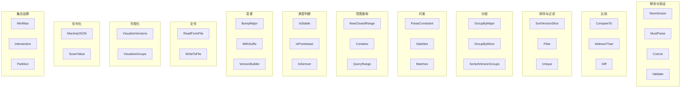
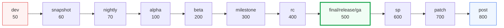
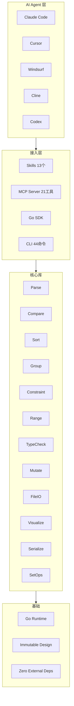
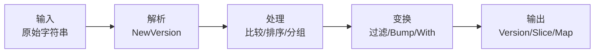
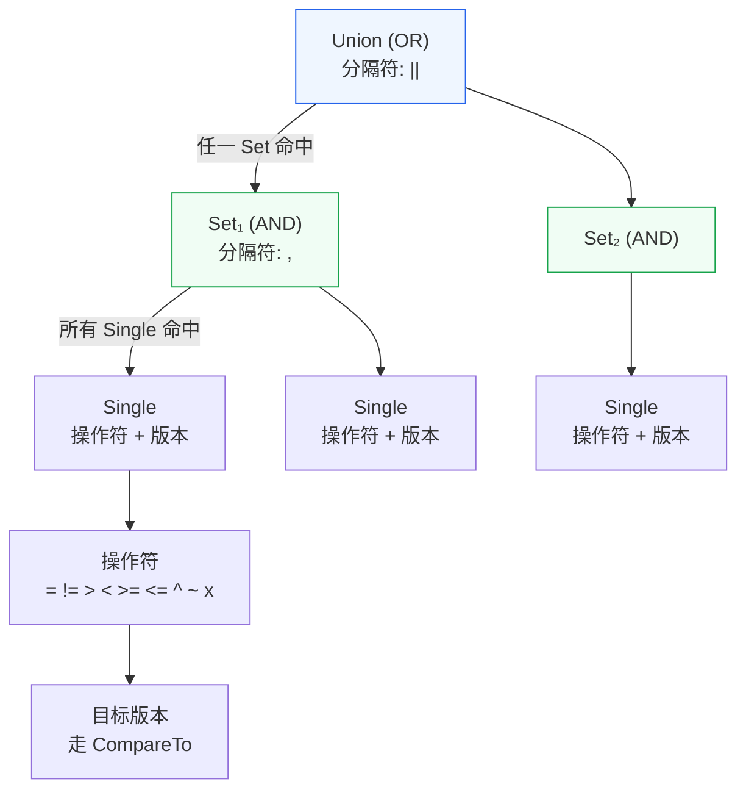
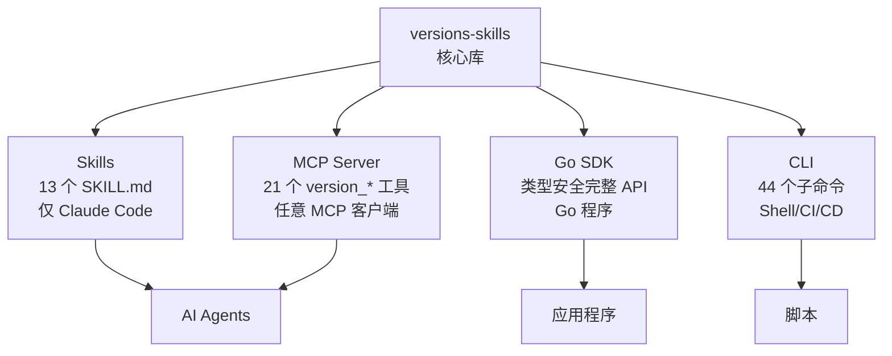

# Versions-Skills

<div align="center">

[](https://github.com/scagogogo/versions-skills/actions/workflows/go-test.yml)
[](https://goreportcard.com/report/github.com/scagogogo/versions-skills)
[](https://pkg.go.dev/github.com/scagogogo/versions-skills)
[](https://github.com/scagogogo/versions-skills/releases/latest)
[](https://opensource.org/licenses/MIT)

**面向 AI 原生的版本号工具集 — 用 Go 解析、比较、排序、分组和约束检查版本号**

为 Agent 时代而生：所有能力都可通过 🤖 **Claude Code Skills** 和 🔌 **MCP** 直接被 AI Agent 调用，底层另附 📦 **Go SDK** 和 💻 **CLI**。

原生兼容 **Claude Code**、**Codex**、**Cursor**、**Windsurf**、**Cline**、**VS Code Copilot** 及所有 MCP 兼容的 AI Agent。

[功能特性](#功能特性) · [AI Agent 集成](#ai-agent-集成架构) · [English](./README.md)

</div>

---

## 功能特性



*versions-skills 全部能力 — 12 个功能域，3 级层次从类别到具体 API*

<div align="center">

**面向 AI 原生的版本号工具集 — 用 Go 解析、比较、排序、分组和约束检查版本号**

为 Agent 时代而生：所有能力都可通过 🤖 **Claude Code Skills** 和 🔌 **MCP** 直接被 AI Agent 调用，底层另附 📦 **Go SDK** 和 💻 **CLI**。

原生兼容 **Claude Code**、**Codex**、**Cursor**、**Windsurf**、**Cline**、**VS Code Copilot** 及所有 MCP 兼容的 AI Agent。

</div>

- 🔄 **全面的版本号支持** — 标准语义化版本（`1.2.3`）、带前缀（`v1.2.3`）、预发布（`1.2.3-beta1`）及自定义格式
- 🧩 **灵活的解析** — 自动识别前缀、数字部分、后缀和元数据，支持自定义分隔符
- 📊 **语义化比较** — 基于后缀权重排序（dev < alpha < beta < rc < stable）
- 📦 **分组与排序** — 按主/次版本号分组，支持稳定的预发布版本排序
- 🔍 **范围查询** — 支持灵活的边界包含/排除策略
- 📋 **约束表达式** — 完整的 npm 风格约束：`>=1.0.0`、`^1.2.3`、`~1.2`、`1.x`、`>=1.0.0,<2.0.0 || >=3.0.0`
- 🏷️ **Semver 规范** — `IsSemver()`、`ValidateSemver()` 严格遵循 SemVer 2.0.0
- 📁 **文件支持** — 从文件读取/写入版本号列表，支持注释
- 🌳 **可视化** — Unicode 树形版本层次结构展示
- 🔧 **不可变操作** — `With*` 和 `Bump*` 方法永不修改原始对象
- 🔗 **序列化** — 内置 JSON、Text、SQL Scanner/Valuer 支持
- 🚀 **零依赖** — 核心库无外部依赖



*语义比较优先级：后缀权重决定预发布版本排序*

### 算法详解

本节记录 AI Agent（或人类）在不读源码的情况下预测库行为所需的精确语义。下面每条规则都可在对应源文件中验证。

#### 1. 解析 —— 三段式 + 元数据（`parser.go`）

每个版本字符串被拆为四个字段：

```
 v1.2.3-beta1+build.7
 │ └─┬─┘ └──┬──┘ └──┬──┘
 │  │      │       └─ Metadata   （semver 构建元数据，"+" 之后）
 │  │      └─ Suffix             （数字部分之后的全部内容）
 │  └─ VersionNumbers            （整数段，以点分隔）
 └─ Prefix                       （非数字前导，如 "v"、"release-"）
```

算法步骤（顺序固定）：

1. **Trim** 去除首尾空白。空串 → 无效版本，`VersionNumbers` 为空数组。
2. **剥离 metadata**：找最后一个 `+`，其后的内容**仅当不含 `-`** 时才视为 metadata —— 因此 `0.9.0+121-bcc5decc` 会把 `121-bcc5decc` 保留在后缀里（Scala/Maven 风格），而 `1.2.3+build.7` 才把 `build.7` 剥到 `Metadata`。这是为了区分 semver 元数据与合法含 `-` 的预发布标识。
3. **纯字母快捷路径**：若剩余串完全不含数字，整个串作为 `Prefix`，`VersionNumbers` 为空（即无效版本，如 `"abc"`）。
4. **读前缀**：扫到第一个数字，之前的内容即前缀。`v1.2.3` → 前缀 `"v"`；`.1` → 前缀 `""`。
5. **读数字**：从第一个数字起，收集由配置分隔符（默认 `.`）分隔的数字段。连续分隔符折叠；遇到非数字非分隔符即停止。`1.2.48` → `[1,2,48]`。
6. **读后缀**：数字部分定位之后的所有内容。先用一组正则处理常见模式（`-snapshot.…`、`-v2.x.x`、`-revN-…`、`+nnn-xxxx`、`-beta1`），都匹配不上则取"剩余字符串"。

`Coerce(s)` 做同样的事，但先从任意文本里抽出符合版本形态的子串（`"program-1.2.3-linux-amd64"` → `"1.2.3"`）。

> **分隔符可统一**：解析支持可配置的 `Delimiters`，但 `VersionNumbers.BuildGroupID()` 重建时一律用 `.` 拼接 —— 所以 `"1/2/3"` 与 `"1.2.3"` 产生相同的规范数字形态。

#### 2. 比较 —— 四级优先级（`version.go: CompareTo`）

`a.CompareTo(b)` 返回 `-1/0/1`，按顺序尝试以下键，**第一个不同的胜出**：

| # | 键 | 规则 | 源文件 |
|:--:|:--|:--|:--|
| 1 | **VersionNumbers** | 从左到右逐位 `int` 比较；共享位全部相等时，**更长的更大**（`1.2` < `1.2.0`，见下方注意）。 | `version_numbers.go` |
| 2 | **Suffix** | 稳定版（无后缀）**大于**预发布版（有后缀）：`1.0.0` > `1.0.0-rc`。两个后缀都按[后缀权重](#3-后缀权重排序suffix_weightgo)比较。 | `version.go` / `version_suffix.go` |
| 3 | **PublicTime** | 若两者 `PublicTime` 均非零，晚者胜。仅当数字与后缀都相等时才走到这一步。 | `version.go` |
| 4 | **原始串** | 最终兜底：按 `Raw` 字典序。 | `version.go` |

> **关于长度**：`VersionNumbers.CompareTo` 把 `1.2` 视为**小于** `1.2.0`（共享段相等时短者小）。实际含义：2 段版本会排在其 3 段兄弟之下 —— 如果你指的就是那个发布版，请显式写 `1.2.0`。

正是这套排序使得 `1.0.0-alpha` < `1.0.0-beta` < `1.0.0-rc1` < `1.0.0` < `1.0.0-post1`，贴合真实发布阶梯，而非朴素 ASCII 序。

#### 3. 后缀权重排序（`suffix_weight.go`）

每个后缀（大小写不敏感，可有前导 `-`/`.`）与一张有序模式表匹配。命中的**权重**决定其排名；若两者权重相同，再用尾部整数（"子版本号"，如 `-alpha1` 里的 `1`）破平。

| 权重 | 后缀模式（示例） | 含义 |
|-------:|:--|:--|
| 50 | `dev`、`dev1`、`.dev.2` | 开发构建 |
| 60 | `snapshot`、`snapshot20201012…` | 快照 |
| 70 | `nightly` | 夜间构建 |
| 100 | `a`、`alpha`、`alpha1`、`.alpha.2` | Alpha |
| 200 | `b`、`beta`、`beta2` | Beta |
| 300 | `m`、`milestone`、`m1` | 里程碑 |
| 400 | `rc`、`rc1` | 候选发布 |
| 410 | `pre`、`pre1` | 预发布 |
| 420 | `cr`、`cr1` | RC 的 CR 变体 |
| 500 | `final`、`release`、`ga` | 正式版/GA（与无后缀等权） |
| 600 | `sp`、`sp1` | 服务包 |
| 700 | `patch`、`patch1` | 补丁 |
| 800 | `post`、`post1` | 后发布（PEP 440） |

值得记住的规则：
- **未知后缀排在已知后缀之后**：不匹配任何模式的后缀，权重低于任何已知预发布类型；彼此之间退化为字典序。
- `final`、`release`、`ga` 权重都是 500 —— 排序上与无后缀完全等价，但 `IsStable()` 只在后缀**字面为空**时返回 true。`1.0.0-ga` 在排序上是正式权重，但按"空后缀"判稳定版时不算稳定。

#### 4. 约束语法 —— 三层（`constraint.go`）

```
Union  (OR)   : ">1.0.0,<2.0.0 || >=3.0.0"     ← 以 "||" 切分
  └─ Set (AND) : ">=1.0.0,<2.0.0"              ← 以 "," 切分
       └─ Single: ">=1.0.0" | "^1.2.3" | "~1.2" | "1.x" | "1.2.3"
```

`ConstraintUnion.Match(v)`：**任一** Set 命中即 true。`ConstraintSet.Match(v)`：**所有** Single 命中才 true。单个 `Constraint` = 操作符 + 目标版本。

支持的操作符及其精确语义（比较一律走 `Version.CompareTo`，因此后缀权重生效）：

| 操作符 | 名称 | base | v 命中条件 |
|:--:|:--|:--|:--|
| `=` | 等于 | `1.2.3` | `v == 1.2.3`（裸写 `1.2.3` 即 `=`） |
| `!=` | 不等 | `1.2.3` | `v != 1.2.3` |
| `>` `<` `>=` `<=` | 范围比较 | `1.2.3` | 直接 `CompareTo` |
| `^` | caret | `^1.2.3` | `v >= 1.2.3` 且 `v < {首个非零段+1, 0…}` |
| `~` | tilde | `~1.2.3` | `v >= 1.2.3` 且 `v < {major, minor+1, 0…}` |
| `x`/`X`/`*` | 通配 | `1.x` | `v >= 1.0.0` 且 `v < {末位非零+1, 0…}` |

**Caret 边界**（兼容范围 —— "左起第一个非零位"）：
- `^1.2.3` → `>=1.2.3, <2.0.0`（进位 `1`）
- `^0.2.3` → `>=0.2.3, <0.3.0`（首个非零是 minor）
- `^0.0.3` → `>=0.0.3, <0.0.4`（首个非零是 patch）

**Tilde 边界**（锁定到 minor）：
- `~1.2.3` → `>=1.2.3, <1.3.0`
- `~1.2`   → `>=1.2.0, <1.3.0`（patch 开放）

**通配边界**（进位最后一个指定位）：
- `1.x`   → `>=1.0.0, <2.0.0`
- `1.2.x` → `>=1.2.0, <1.3.0`

#### 5. 范围查询 —— 开/闭区间（`version_range.go`）

`VersionRange{Low, High, LowInclusive, HighInclusive}` 通过四步边界检查判定归属：

- `Low == nil` → 无下界；`High == nil` → 无上界。
- 下界侧：`v < Low` 不通过；`v == Low && !LowInclusive` 不通过（开区间排除端点）。
- 上界侧对称。

所以 `NewClosedRange(1.0.0, 2.0.0)` = `[1.0.0, 2.0.0]`（两端含），`NewOpenRange` = `(1.0.0, 2.0.0)`（两端不含），还可混用：`NewVersionRange(1.0.0, 2.0.0, true, false)` = `[1.0.0, 2.0.0)`。`IsEmpty()` 检测 `Low > High` 的退化区间，或 `Low == High` 但至少一端为开。

#### 6. 排序与分组 —— 两阶段、组感知（`sort.go`、`version_group.go`）

`SortVersionSlice` **不是**朴素的 `sort.Slice`，而是两阶段：

1. **分组**：按 `BuildGroupID()`（完整数字串，如 `1.2.3`）把所有版本归组。
2. **排序组**：按组的数字前缀（`VersionGroup.CompareTo`）排组，**组内再排序**，最后拼接。

收益：`1.10.0` 正确排在 `1.2.0` 之后（数值比较而非字符串），同族版本聚在一起。

**分组粒度 —— 两个不同 API，别混淆：**

| 函数 | 分组依据 | 键类型 | 示例桶 |
|:--|:--|:--|:--|
| `Group(versions)` | **完整数字串**（`BuildGroupID`） | `map[string]*VersionGroup` | `1.2.3` 与 `1.2.4` 分属**不同**组（`"1.2.3"`、`"1.2.4"`） |
| `GroupByMajor(versions)` | **仅 major 段**（`Major()`） | `map[int][]*Version` | `1.2.3`、`1.2.4`、`1.9.0` 都在组 `1` |
| `GroupByMinor(versions)` | **major.minor** | `map[string][]*Version` | `1.2.3`、`1.2.4` 在组 `"1.2"` |

`Group()` 是排序与范围查询内部用的；`GroupByMajor`/`GroupByMinor` 是便捷分桶，用于"给我 1.x 这条线下的全部"。

#### 7. 有序索引上的范围查询 —— `SortedVersionGroups`（`sorted_version_groups.go`）

要对大版本集做反复范围查询，先建一次 `SortedVersionGroups`：

```go
sg := versions.NewSortedVersionGroups(allVersions)   // 分组+排序+建索引，O(n log n)
start := tuple.NewTuple2(versions.NewVersion("1.0.0"), versions.ContainsPolicyYes)
end   := tuple.NewTuple2(versions.NewVersion("2.0.0"), versions.ContainsPolicyNo)
hits  := sg.QueryRange(start, end)                    // 跳索引 + 组遍历
```

它预排序所有组并构建 `groupID → 索引` 映射。`QueryRange` 经映射直接跳到起始组（跳过其下一切），随后逐组收集 `QueryRangeVersions`，直到越过结束组。每个 tuple 上的 `ContainsPolicy` 决定边界版本本身是否纳入（`Yes` 含 / `No` 不含）。这是 `version_range_query` 的底层引擎，远比每次重新过滤全表便宜。

### AI Agent 集成架构



*四层架构：AI Agent → 接口层 → 功能层 → 核心库*

**AI Agent 的两条路径：**
1. **Skills 插件** — Claude Code 读取 `SKILL.md` 文件作为领域知识，然后通过 CLI/MCP/SDK 执行。适合引导式工作流和一次性任务。
2. **MCP Server** — 任何 MCP 兼容客户端直接调用 `version_*` 工具。适合编程式调用、批量操作和非 Claude Agent。

**两者配合使用效果最佳** — Skills 提供"如何做"的知识，MCP 提供执行引擎。

#### 各 Agent 选哪条路径？

| AI Agent / IDE | Skills | MCP (stdio) | MCP (SSE) | 配置位置 |
|:--|:--:|:--:|:--:|:--|
| **Claude Code** | ✅ `claude plugin install versions` | ✅ | ✅ | `~/.claude/settings.json` |
| **Codex**（OpenAI CLI） | — | ✅ | ✅ | `~/.codex/config.toml`（或 `codex mcp add`） |
| **Cursor** | — | ✅ | ✅ | `.cursor/mcp.json` |
| **Windsurf** | — | ✅ | ✅ | `.windsurf/mcp.json` |
| **Cline**（VS Code） | — | ✅ | ✅ | `~/.cline/cline_mcp_settings.json` |
| **VS Code Copilot** | — | ✅ | ✅ | `.vscode/mcp.json` |
| *任意 MCP 客户端* | — | ✅ | ✅ | 按客户端而定 |

> **建议：** 在 Claude Code 上**同时**安装 Skills 插件和 MCP server —— 插件让 Claude 掌握版本号领域知识（何时用约束、何时用范围、后缀如何排序），MCP 提供快速、结构化的执行通道。其它 Agent 只需 MCP server 一条路径即可。

#### 按 Agent 快速开始

**Claude Code** —— 同时装上斜杠命令和 MCP 工具：

```bash
# 1. 把 13 个斜杠命令作为领域知识装进来
claude plugin marketplace add https://github.com/scagogogo/versions-skills
claude plugin install versions

# 2. 直连工具执行（可选但推荐）
claude mcp add versions -- versions-mcp --transport stdio
```

之后你可以输入 `/version-sorting` 让它一步步引导，也可以直接说"帮我给这些版本号排序"，Claude 会自行调用 `version_sort`。

**Codex**（OpenAI CLI）：

```bash
# 先装二进制
go install github.com/scagogogo/versions-skills/cmd/versions-mcp@latest

# 注册到 Codex
codex mcp add versions -- versions-mcp --transport stdio
```

**Cursor / Windsurf / VS Code Copilot / Cline** —— 装好二进制后，把上方 🔌 MCP Server 小节里对应客户端的 JSON 片段写进[上表](#各-agent-选哪条路径)所列的配置文件即可。



*版本号字符串通过 Input → Parse → Process → Transform → Output 管道流转*



*三层语法：Union (OR) → Set (AND) → Single Constraint → Operator + Version*

### 接入方式



*四种接入方式连接 14 个核心能力*

#### 🤖 Skills（Claude Code）— AI 工作流推荐

两步安装，获得 13 个版本操作斜杠命令：

```bash
# 第一步：添加 Marketplace（一次性）
claude plugin marketplace add https://github.com/scagogogo/versions-skills

# 第二步：安装插件
claude plugin install versions
```

安装后在 Claude Code 中使用斜杠命令：`/version-parsing`、`/version-comparison`、`/version-sorting` 等

> **原理：** 插件包含 13 个 `SKILL.md` 技能文件，Claude Code 将其加载为领域知识。输入 `/version-parsing` 时，Claude 会读取对应的 API 参考、代码示例和决策树，然后通过 SDK/CLI/MCP 执行你的请求。

#### 🔌 MCP Server（AI Agent 通用）— 支持 Claude Code / Codex / Cursor / Windsurf / Cline / VS Code Copilot

```bash
go install github.com/scagogogo/versions-skills/cmd/versions-mcp@latest
```

**Claude Code** — 添加到 `~/.claude/settings.json`：

```json
{
  "mcpServers": {
    "versions": {
      "command": "versions-mcp",
      "args": ["--transport", "stdio"]
    }
  }
}
```

**Cursor** — 添加到项目根目录 `.cursor/mcp.json`：

```json
{
  "mcpServers": {
    "versions": {
      "command": "versions-mcp",
      "args": ["--transport", "stdio"]
    }
  }
}
```

**Windsurf** — 添加到项目根目录 `.windsurf/mcp.json`：

```json
{
  "mcpServers": {
    "versions": {
      "command": "versions-mcp",
      "args": ["--transport", "stdio"]
    }
  }
}
```

**VS Code (Copilot)** — 添加到项目根目录 `.vscode/mcp.json`：

```json
{
  "servers": {
    "versions": {
      "command": "versions-mcp",
      "args": ["--transport", "stdio"]
    }
  }
}
```

**Codex（OpenAI CLI）** — 用 `codex mcp` 命令注册（会写入 `~/.codex/config.toml`）：

```bash
codex mcp add versions -- versions-mcp --transport stdio
```

或直接编辑 `~/.codex/config.toml`：

```toml
[mcp_servers.versions]
command = "versions-mcp"
args = ["--transport", "stdio"]
```

> 在 Codex 中该 server 显示为 `versions` MCP server。启动 `codex` 会话后，`version_*` 工具会自动对 Agent 可用。

**Cline（VS Code）** — 添加到 `~/.cline/cline_mcp_settings.json`（也可通过 Cline UI → *MCP Servers → + Add Server*）：

```json
{
  "mcpServers": {
    "versions": {
      "command": "versions-mcp",
      "args": ["--transport", "stdio"],
      "disabled": false,
      "autoApprove": []
    }
  }
}
```

**网络模式（SSE）** —— 团队/共享部署用：

```bash
versions-mcp --transport sse --port 8080
```

然后让任意 MCP 客户端指向 `http://localhost:8080/sse`（在客户端配置里改用 SSE/HTTP 传输选项，而非 `command`）。

> **没看到你的客户端？** 任何支持 MCP 的工具都能接入 —— 把它的 stdio 命令指向 `versions-mcp --transport stdio`，或把 HTTP 传输指向上面的 SSE 端点即可。选型决策见上方[各 Agent 选哪条路径？](#各-agent-选哪条路径) 表。

#### 📦 Go SDK — Go 开发者推荐

```bash
go get github.com/scagogogo/versions-skills
```

#### 💻 CLI — 脚本和 CI/CD 推荐

从 [GitHub Releases](https://github.com/scagogogo/versions-skills/releases/latest) 下载，或：

```bash
go install github.com/scagogogo/versions-skills/cmd/versions@latest
```
