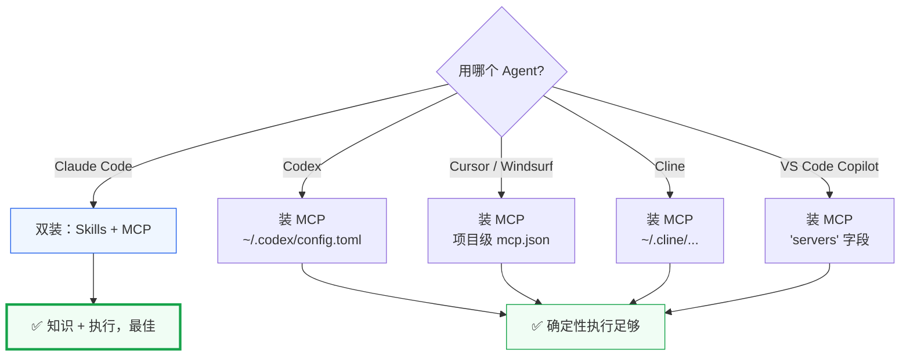

# AI Agent 接入指南

versions-skills 对 AI Agent 的接入分两条路径，下表帮你选：



| AI Agent / IDE | Skills 插件 | MCP (stdio) | MCP (SSE) | 配置位置 |
|:--|:--:|:--:|:--:|:--|
| **Claude Code** | ✅ `claude plugin install versions` | ✅ | ✅ | `~/.claude/settings.json` |
| **Codex**（OpenAI CLI） | — | ✅ | ✅ | `~/.codex/config.toml` |
| **Cursor** | — | ✅ | ✅ | `.cursor/mcp.json` |
| **Windsurf** | — | ✅ | ✅ | `.windsurf/mcp.json` |
| **Cline**（VS Code） | — | ✅ | ✅ | `~/.cline/cline_mcp_settings.json` |
| **VS Code Copilot** | — | ✅ | ✅ | `.vscode/mcp.json` |
| *任意 MCP 客户端* | — | ✅ | ✅ | 按客户端而定 |

::: tip 选型
- **Claude Code**：同时装 Skills + MCP。Skills 给 Claude 版本号领域知识（何时用约束、后缀如何排序），MCP 给它结构化执行通道。
- **其它 Agent（Codex 等）**：只需 MCP Server。工具返回的确定性结果就是 AI 需要的全部。
- **不想手动配置？** 直接用 [一键提示词](./prompts)，让 AI 自己装。
:::

## 前置：安装 versions-mcp 二进制

所有 MCP 接入都需要 `versions-mcp` 二进制在 PATH 中。三选一：

::: code-group

```bash title="Go 安装（需 Go 1.21+）"
go install github.com/scagogogo/versions-skills/cmd/versions-mcp@latest
```

```bash title="一键脚本（Linux/macOS，自动检测平台）"
curl -sL https://raw.githubusercontent.com/scagogogo/versions-skills/main/install.sh | bash
```

```bash title="手动下载（GitHub Releases）"
# 从 https://github.com/scagogogo/versions-skills/releases/latest
# 下载对应平台的 versions-mcp 二进制，解压后放到 PATH：
chmod +x versions-mcp && sudo mv versions-mcp /usr/local/bin/
```

:::

## Claude Code

Skills 插件 + MCP Server 双装：

```bash
# 1. 领域知识：14 个斜杠命令
claude plugin marketplace add https://github.com/scagogogo/versions-skills
claude plugin install versions

# 2. 执行通道：21 个 MCP 工具
claude mcp add versions -- versions-mcp --transport stdio
```

或手动写 `~/.claude/settings.json`：

```json
{
  "mcpServers": {
    "versions": {
      "command": "versions-mcp",
      "args": ["--transport", "stdio"]
    }
  }
}
```

装好后：输入 `/version-sorting` 走引导式流程，或直接说"帮我排序这些版本"让 Claude 调 `version_sort`。

## Codex（OpenAI CLI）

用 `codex mcp` 命令注册（写入 `~/.codex/config.toml`）：

```bash
codex mcp add versions -- versions-mcp --transport stdio
```

或直接编辑 `~/.codex/config.toml`：

```toml
[mcp_servers.versions]
command = "versions-mcp"
args = ["--transport", "stdio"]
```

启动 `codex` 会话后，`version_*` 工具自动对 Agent 可用。

## Cursor

项目根目录 `.cursor/mcp.json`：

```json
{
  "mcpServers": {
    "versions": {
      "command": "versions-mcp",
      "args": ["--transport", "stdio"]
    }
  }
}
```

## Windsurf

项目根目录 `.windsurf/mcp.json`：

```json
{
  "mcpServers": {
    "versions": {
      "command": "versions-mcp",
      "args": ["--transport", "stdio"]
    }
  }
}
```

## Cline（VS Code）

`~/.cline/cline_mcp_settings.json`（也可通过 Cline UI → *MCP Servers → + Add Server*）：

```json
{
  "mcpServers": {
    "versions": {
      "command": "versions-mcp",
      "args": ["--transport", "stdio"],
      "disabled": false,
      "autoApprove": []
    }
  }
}
```

## VS Code Copilot

项目根目录 `.vscode/mcp.json`（注意字段名是 `servers` 不是 `mcpServers`）：

```json
{
  "servers": {
    "versions": {
      "command": "versions-mcp",
      "args": ["--transport", "stdio"]
    }
  }
}
```

## SSE 网络模式（团队共享）

把 Server 部署一次，团队共用：

```bash
versions-mcp --transport sse --port 8080
# 端点：http://localhost:8080/sse
```

各客户端在配置里用 HTTP/SSE 传输选项指向该端点，而非 `command` 字段。

::: details 没看到你的客户端？
任何支持 MCP 的工具都能接入——把它的 stdio 命令指向 `versions-mcp --transport stdio`，或把 HTTP 传输指向上面的 SSE 端点即可。
:::

→ 想让 AI 自动完成上面所有配置？用 [一键提示词](./prompts)。想看可用工具清单？进 [MCP 工具](/mcp/)。
