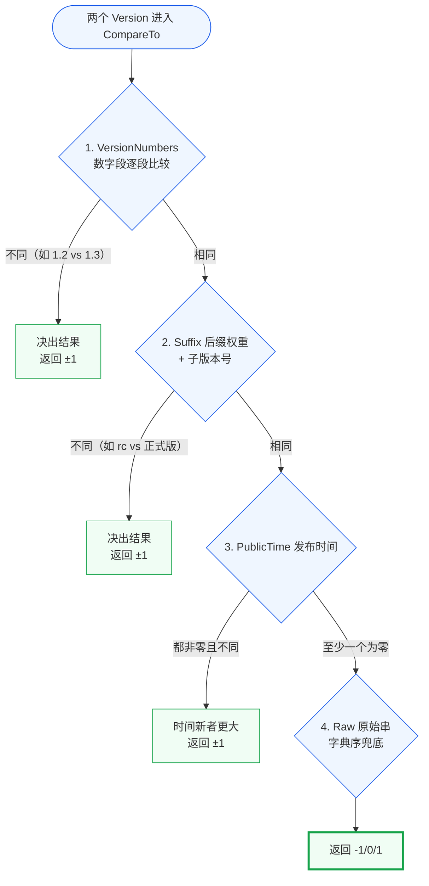

# 比较优先级

::: tip 关键
`Version.CompareTo` 按 **四级优先级** 逐级判定：`VersionNumbers → Suffix → PublicTime → Raw`。
:::

## 📐 判定流程

每一级**只在前几级都判定为「相等」时才进入下一级**——任一级决出不同即立即返回，不再往下走。

## 🔍 示例

| A | B | 结果 | 命中级 |
|:--|:--|:--|:--|
| `1.2.0` | `1.3.0` | A < B | VersionNumbers（2 < 3） |
| `1.0.0-rc1` | `1.0.0` | A < B | Suffix（rc=400 < 稳定=500） |
| `1.0.0` | `1.0.0-post1` | A < B | Suffix（稳定=500 < post=800，反直觉见[后缀权重](/concepts/suffix-weight)） |
| `1.0.0-beta1` | `1.0.0-beta2` | A < B | Suffix（子版本号 1 < 2） |
| `1.0.0` | `v1.0.0` | A == B | 前缀不参与，Raw 在前三者相同时… |

::: warning 注意
`1.0.0` 与 `v1.0.0`：数字段相同、后缀都为空、PublicTime 都是零值，最终落到 **Raw 字典序**。`"1.0.0"` < `"v1.0.0"`（'1' < 'v'）。但语义上二者**等价**——业务里若要判等价，用 [`Equals`](/sdk/api/equals-version) 或比较 `Canonical()`。
:::

## 📚 延伸

- API：[`Version.CompareTo`](/sdk/api/compare-to-version) · [`IsNewerThan`](/sdk/api/is-newer-than-version) · [`IsBetween`](/sdk/api/is-between-version)
- 概念：[后缀权重](/concepts/suffix-weight) · [版本号结构](/concepts/version-anatomy)
