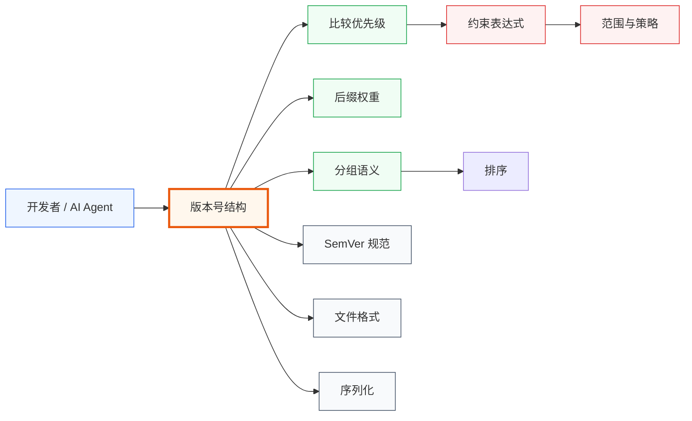

# 概念索引

学习 versions-skills 需要掌握的核心概念。每个概念都有一篇专题文档。

## 📚 概念清单

| 概念 | 文档 | 一句话 |
|:--|:--|:--|
| 版本号结构 | [版本号结构](/concepts/version-anatomy) | 前缀 + 数字段 + 后缀 + 元数据 |
| 后缀权重 | [后缀权重](/concepts/suffix-weight) | dev<snapshot<nightly<alpha<beta<milestone<rc<final<sp<patch<post |
| 比较优先级 | [比较优先级](/concepts/compare-priority) | VersionNumbers → Suffix → PublicTime → Raw |
| 分组语义 | [分组语义](/concepts/grouping) | 按数字前缀归组 |
| 约束表达式 | [约束表达式](/concepts/constraints) | `= != > >= < <= ^ ~ x` |
| 范围与包含策略 | [范围与包含策略](/concepts/range-and-policy) | 开/闭区间 + ContainsPolicy |
| 不可变性 | [不可变性](/concepts/immutability) | 所有 With\*/Bump\* 返回新对象 |
| SemVer 规范 | [SemVer 规范](/concepts/semver) | 严格三段 + 预发布 + 构建元数据 |
| 文件格式 | [文件格式](/concepts/file-format) | 每行一个版本，`#` 非注释符 |
| 序列化 | [序列化](/concepts/serialization) | JSON / Text / SQL 三类接口 |
| 三层接入 | [三层接入](/concepts/three-layers) | SDK → CLI → MCP |
| 零依赖设计 | [零依赖设计](/concepts/zero-deps) | 核心仅依赖 golang-infrastructure 自研库 |

## 🗺 学习路径

- **新手**：[版本号结构](/concepts/version-anatomy) → [比较优先级](/concepts/compare-priority) → [后缀权重](/concepts/suffix-weight) → [10 分钟入门](/tutorials/getting-started)
- **进阶**：[分组语义](/concepts/grouping) → [约束表达式](/concepts/constraints) → [范围与策略](/concepts/range-and-policy)
- **架构**：[三层接入](/concepts/three-layers) → [零依赖设计](/concepts/zero-deps) → [不可变性](/concepts/immutability)
