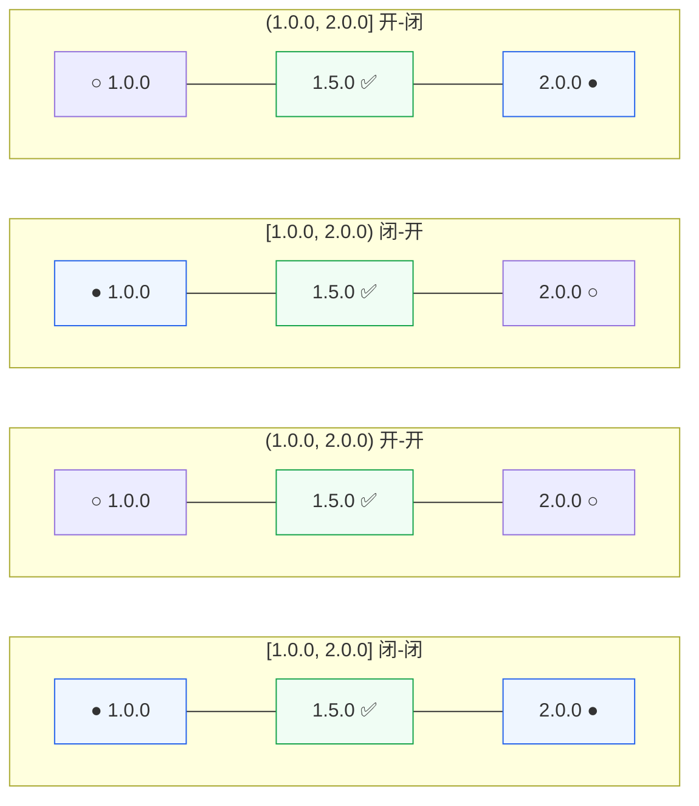

# 范围与包含策略

::: tip 关键
`VersionRange` 描述一个**数值区间**（开/闭边界）；`ContainsPolicy` 控制**端点字符串**的包含/排除。
:::

## 🎚 VersionRange

```go
r := versions.NewClosedRange(versions.NewVersion("1.0.0"), versions.NewVersion("2.0.0"))
r.Contains(versions.NewVersion("1.5.0")) // true（闭区间含两端）
r.Filter(vs) // 过滤出区间内的版本
```

| 构造器 | 边界 | 示例 |
|:--|:--|:--|
| `NewClosedRange(low, high)` | `[low, high]` 含两端 | `[1.0.0, 2.0.0]` |
| `NewOpenRange(low, high)` | `(low, high)` 不含两端 | `(1.0.0, 2.0.0)` |
| `NewVersionRange(low, high, loIn, hiIn)` | 自定义两端开闭 | — |

四种开闭组合示意（`●` 为闭端点，含；`○` 为开端点，不含）：



## 🎚 ContainsPolicy

`ContainsPolicy` 用于 `SortedVersionGroups.QueryRange`，控制是否包含**匹配某字符串**的端点：

| 枚举 | 值 | 语义 |
|:--|:--|:--|
| `ContainsPolicyNone` | 0 | 不基于字符串过滤 |
| `ContainsPolicyYes` | 1 | 仅保留包含指定字符串的版本 |
| `ContainsPolicyNo` | 2 | 排除包含指定字符串的版本 |

典型用途：在 `[1.0.0, 2.0.0]` 范围内**排除所有预发布版本**（`ContainsPolicyNo` + `"-"`）。

## 📚 延伸

- API：[`VersionRange`](/sdk/api/version-range) · [`ContainsPolicy`](/sdk/api/contains-policy) · [`SortedVersionGroups.QueryRange`](/sdk/api/query-range-sortedversiongroups)
- 概念：[约束表达式](/concepts/constraints) · [分组语义](/concepts/grouping)
- CLI：[`range`](/cli/commands/range)
