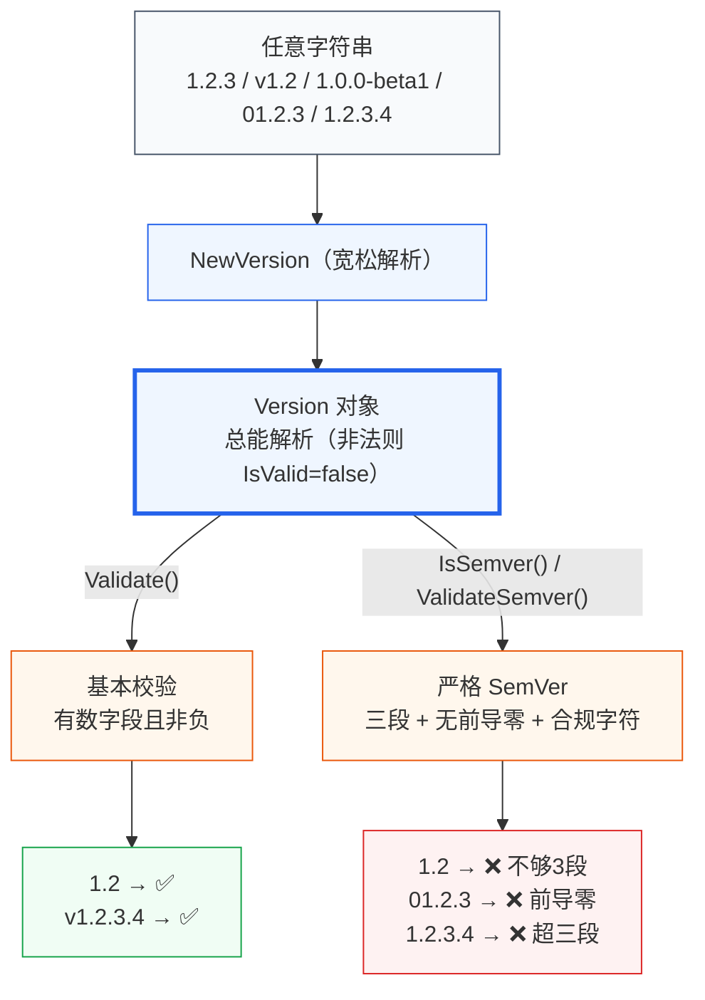

# SemVer 规范

::: tip 关键
versions-skills 支持 [SemVer 2.0.0](https://semver.org/) 严格校验，同时兼容更宽松的「版本号」概念。
:::

## 📐 严格 SemVer

`IsSemver()` 用正则严格判定，要求：

- **三段**：`MAJOR.MINOR.PATCH`
- **无前导零**：`01.02.03` 非法
- 可选 `v` 前缀
- 可选预发布段：`-alpha.1`、`-rc.2`
- 可选构建元数据：`+build.7`

```go
versions.NewVersion("1.2.3").IsSemver()               // true
versions.NewVersion("1.2.3-alpha.1+build.7").IsSemver() // true
versions.NewVersion("1.2").IsSemver()                 // false（不够3段）
versions.NewVersion("01.2.3").IsSemver()              // false（前导零）
```

## 🔍 Validate vs ValidateSemver

| 方法 | 严格度 | 要求 |
|:--|:--|:--|
| `Validate()` | 基本校验 | 有数字部分且非负 |
| `ValidateSemver()` | 严格 SemVer | 三段 + 无前导零 + 字符符合规 |

## 🆚 宽松版本号

versions-skills 的 `Version` 比 SemVer 宽松——`1.2`、`v1.2.3.4`、`1.0.0-beta1` 都能解析。只有需要 SemVer 合规性时才用 `IsSemver` / `ValidateSemver`。



## 📚 延伸

- API：[`IsSemver`](/sdk/api/is-semver-version) · [`ValidateSemver`](/sdk/api/validate-semver-version) · [SDK 索引](/sdk/)
- 概念：[版本号结构](/concepts/version-anatomy) · [后缀权重](/concepts/suffix-weight)
- CLI：[`check --semver`](/cli/commands/check) · [`validate`](/cli/commands/validate)
