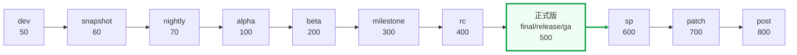

# 后缀权重

::: tip 关键
当两个版本的**数字段完全相同**时，按后缀权重决定先后。权重越大越「新」。绝大多数情况下稳定版 > 预发布版，但 `sp`/`patch`/`post` 是例外（见下方 warning）。
:::

## 📊 权重表

| 权重值 | 枚举 | 后缀 | 语义 |
|:--|:--|:--|:--|
| 0 | `SuffixWeightUnknown` | 未知 | 无法识别 |
| 50 | `SuffixWeightDev` | `dev` | 开发版 |
| 60 | `SuffixWeightSnapshot` | `snapshot` | 快照版 |
| 70 | `SuffixWeightNightly` | `nightly` | 夜间构建 |
| 100 | `SuffixWeightAlpha` | `alpha` | Alpha |
| 200 | `SuffixWeightBeta` | `beta` | Beta |
| 300 | `SuffixWeightMilestone` | `milestone` (m) | 里程碑 |
| 400 | `SuffixWeightRC` | `rc` | 候选发布 |
| 410 | `SuffixWeightPre` | `pre` | 预发布 |
| 420 | `SuffixWeightCR` | `cr` | CR 变体 |
| 500 | `SuffixWeightFinal`/`Release`/`GA` | `final`/`release`/`ga` | 正式版（三者等权） |
| 600 | `SuffixWeightSP` | `sp` | 服务包 |
| 700 | `SuffixWeightPatch` | `patch` | 补丁 |
| 800 | `SuffixWeightPost` | `post` | Post 发布（PEP 440） |

::: warning 反直觉：sp/patch/post 高于正式版
`sp(600)`、`patch(700)`、`post(800)` 的权重**大于**正式版 `final/release/ga(500)`。语义上 `1.0.0-sp1` 是 `1.0.0` 正式版**之后**发布的服务包，`1.0.0-post1` 是 PEP 440 中正式版**之后**的修订。因此：

```go
versions.NewVersion("1.0.0-post1").IsNewerThan(versions.NewVersion("1.0.0")) // true
versions.NewVersion("1.0.0-sp1").IsNewerThan(versions.NewVersion("1.0.0"))   // true
```

排序结果：`1.0.0-rc1` < `1.0.0` < `1.0.0-sp1` < `1.0.0-post1`。
:::

## 🔍 比较示例



权重从左到右递增——**越靠右越「新」**。注意 `sp`/`patch`/`post` 在正式版**右侧**，即比正式版更新。

```go
a := versions.NewVersion("1.0.0-rc1")
b := versions.NewVersion("1.0.0")
a.IsNewerThan(b) // false — rc(400) < 稳定(500)
```

数字段相同，`-rc1` 的权重 400，无后缀的稳定版权重 500，故 `1.0.0` 更新。

## 🧮 子版本号

后缀里的数字（如 `beta1` 的 `1`、`rc2` 的 `2`）作为**子版本号**参与细比较：

- `1.0.0-beta1` < `1.0.0-beta2`（同类后缀，子版本号小者更旧）

## 📚 延伸

- API：[`SuffixWeight`](/sdk/api/suffix-weight) · [`GetSuffixWeight`](/sdk/api/get-suffix-weight) · [`Version.SuffixWeight()`](/sdk/api/suffix-weight-version)
- 概念：[比较优先级](/concepts/compare-priority)
