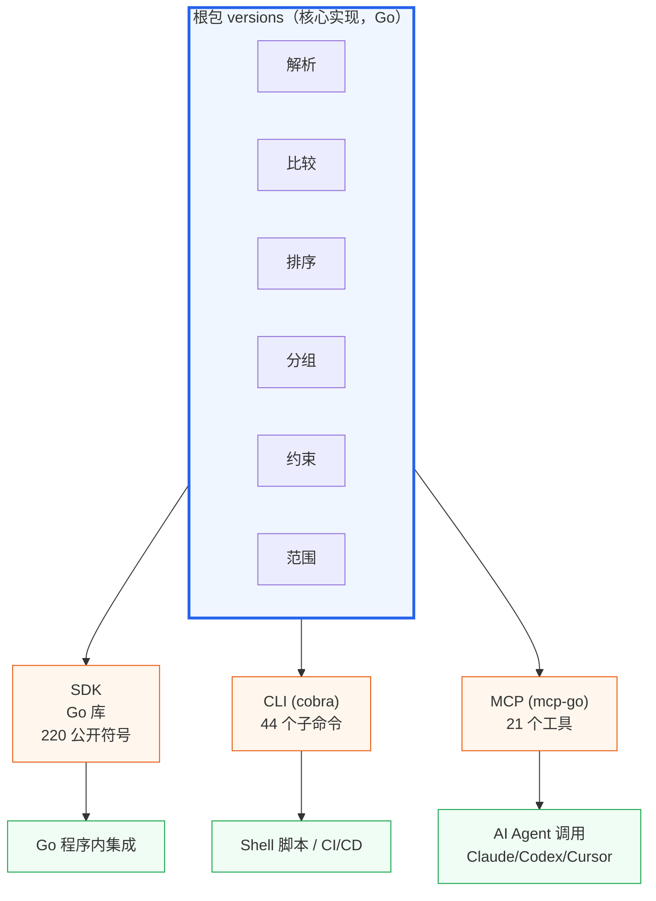

# 三层接入

::: tip 关键
同一套版本号能力，**三种入口**按需选用：**SDK（Go 库）→ CLI（shell）→ MCP（AI 工具）**。
:::

## 🏗 三层架构

三层共享**同一份核心代码**，行为完全一致——SDK 怎么比较，CLI 与 MCP 就怎么比较。

## 🎯 如何选型

| 场景 | 推荐入口 |
|:--|:--|
| Go 程序内集成 | **SDK** |
| Shell 脚本 / CI/CD | **CLI** |
| 让 AI Agent 自动处理版本 | **MCP** |
| 让 Claude 直接生成命令 | **CLI + [一键提示词](/prompts)** |
| IDE 内代码补全 | **SDK** |

## 🔄 能力对照

| 能力 | SDK 函数 | CLI 命令 | MCP 工具 |
|:--|:--|:--|:--|
| 解析 | `NewVersion` | `parse` | `version_parse` |
| 比较 | `CompareTo` | `compare` | `version_compare` |
| 排序 | `SortVersionSlice` | `sort` | `version_sort` |
| 分组 | `Group` | `group` | `version_group` |
| 约束 | `ParseConstraint` | `constraint` | `version_constraint_check` |
| 范围 | `NewClosedRange` | `range` | `version_range_query` |
| 递增 | `BumpMajor` | `bump` | `version_bump` |
| 文件 | `ReadVersionsFromFile` | `read`/`write` | `version_read_file`/`version_write_file` |

完整对照见各入口的总览页：[SDK](/sdk/) · [CLI](/cli/) · [MCP](/mcp/)。

## 📚 延伸

- 概念：[零依赖设计](/concepts/zero-deps)
- 入门：[快速开始](/quick-start)
