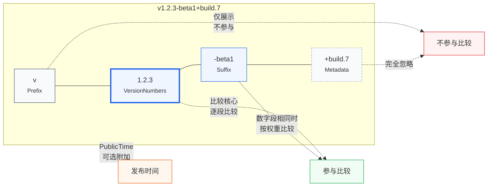

# 版本号结构

::: tip 关键
一个版本号被解析为 **5 个组成部分**：`Raw` / `Prefix` / `VersionNumbers` / `Suffix` / `Metadata`（外加可选的 `PublicTime`）。
:::

## 🧱 五段分解

以 `v1.2.3-beta1+build.7` 为例：

```
v  1.2.3  -beta1  +build.7
│  │      │       └─ Metadata（构建元数据，不参与比较）
│  │      └──────── Suffix（数字后内容，按权重比较）
│  └─────────────── VersionNumbers（数字段 []int）
└────────────────── Prefix（数字前导）
```

| 字段 | 类型 | 值 | 说明 |
|:--|:--|:--|:--|
| `Raw` | `string` | `"v1.2.3-beta1+build.7"` | 原始字符串 |
| `Prefix` | `VersionPrefix` | `"v"` | 数字前导，可为空 |
| `VersionNumbers` | `[]int` | `[1, 2, 3]` | 数字段 |
| `Suffix` | `VersionSuffix` | `"-beta1"` | 数字后内容 |
| `Metadata` | `string` | `"build.7"` | semver 构建元数据 |



## 🔍 各段行为

- **Prefix**：仅显示用，**不参与比较**。`1.2.3` 与 `v1.2.3` 等价。
- **VersionNumbers**：比较的核心。逐段比较，缺失段视为 0。
- **Suffix**：当数字段完全相同时，按[后缀权重](/concepts/suffix-weight)比较。
- **Metadata**：完全忽略，仅作展示。

## 🧭 延伸

- 类型定义见 [Version](/sdk/api/version)
- 解析过程见 [工作原理](/how-it-works)
- 后缀比较见 [后缀权重](/concepts/suffix-weight)
