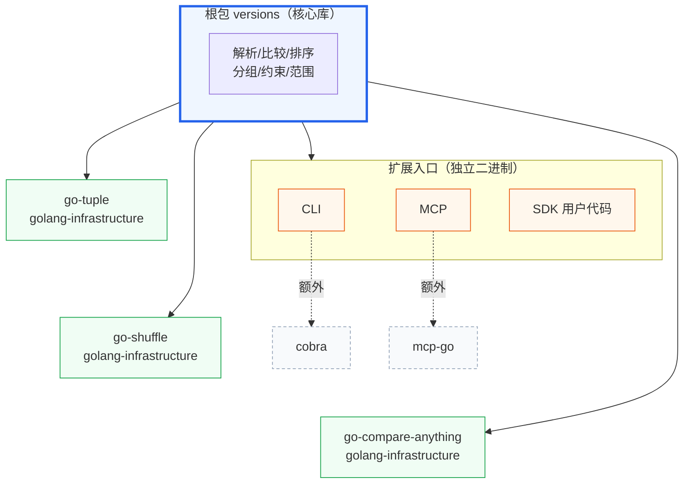

# 零依赖设计

::: tip 关键
根包 `versions` **零外部重依赖**——仅依赖 golang-infrastructure 自研的 3 个小库。
:::

## 📦 依赖清单

| 依赖 | 来源 | 用途 |
|:--|:--|:--|
| `go-tuple` | golang-infrastructure | 二元组（范围查询的端点对） |
| `go-shuffle` | golang-infrastructure | 切片乱序（测试辅助） |
| `go-compare-anything` | golang-infrastructure | 通用 `Comparable` 接口 |

CLI 额外依赖 `cobra`，MCP 额外依赖 `mcp-go`——但**核心库本身**保持轻量。



## ✅ 为什么重要

- **可移植**：无传递依赖地狱，`go get` 即用
- **安全**：依赖面小，供应链风险低
- **可维护**：所有依赖来自同一作者，风格统一、升级可控
- **可嵌入**：适合嵌入到对依赖敏感的工具链 / agent 框架

## 🧪 验证

```bash
go list -m all          # 查看实际依赖
go mod why golang-infrastructure/go-tuple
```

## 📚 延伸

- 概念：[三层接入](/concepts/three-layers)
- 入门：[快速开始](/quick-start)
