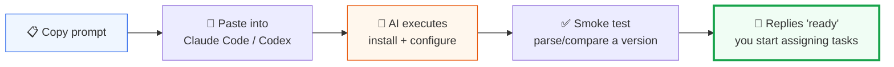

---
# https://vitepress.dev/reference/default-theme-home-page
layout: home
head:
  - - meta
    - http-equiv: content-language
      content: en-US

hero:
  name: Versions-Skills
  text: AI-native version number toolkit
  tagline: Parse, compare, sort, group, and check constraints on version numbers — via Skills + MCP + Go SDK + CLI. Out of the box.
  image:
    src: /favicon.svg
    alt: Versions-Skills
  actions:
    - theme: brand
      text: 🚀 One-line setup for Claude Code
      link: /prompts
    - theme: alt
      text: Why it exists
      link: /why
    - theme: alt
      text: How it works
      link: /how-it-works

features:
  - icon: 🤖
    title: AI-native access
    details: Ships with Claude Code Skills (13 slash commands) and an MCP Server (21 tools). Codex, Cursor, Windsurf, and Cline plug in with one line of config.
  - icon: 🧩
    title: Wide-input parsing
    details: Standard semver, prefixed (v1.2.3), prerelease (1.2.3-beta1), Maven/Scala/PEP 440 styles — all supported. Can also Coerce a version out of any string.
  - icon: 📊
    title: Semantic comparison
    details: Not lexicographic. Compares by "numbers → suffix weight → release time → raw string", so dev < alpha < beta < rc < release — matches real release ladders.
  - icon: 📋
    title: npm-style constraints
    details: Full support for >=, ^, ~, 1.x, and || combinations. Three-level grammar (Union OR / Set AND / Single), semantics consistent with npm/pip.
  - icon: 🌳
    title: Grouping & visualization
    details: Groups and sorts by numeric segments — 1.10.0 lands after 1.2.0 correctly. Unicode tree rendering of version hierarchies.
  - icon: 🚀
    title: Zero-dependency core
    details: The Go core library has no heavy external dependencies and compiles with the standard library. CLI / MCP / Skills share one engine.
---

<div style="margin-top: 48px;">

## 🤖 One-line setup: hand the prompt to your AI and wait

**AI-First onboarding** — no docs to read, no config files to edit. Copy the prompt below to your AI Agent; it installs, configures, and verifies itself, then tells you "ready".

::: tip Three automatic steps
📋 Copy the whole block → ⚡ AI auto-configures → ✅ smoke test
:::

</div>



::: code-group

```markdown title="Claude Code"
I need to handle version numbers — please set up the versions-skills tool.

Execute these steps and report briefly after each:

1. Install the versions plugin for Claude Code (provides 13 version slash commands):
   Run: claude plugin marketplace add https://github.com/scagogogo/versions-skills
   Run: claude plugin install versions

2. Register the versions MCP Server (provides 21 version_* tools you can call directly):
   Run: claude mcp add versions -- versions-mcp --transport stdio
   If versions-mcp binary is missing, install it first:
   go install github.com/scagogogo/versions-skills/cmd/versions-mcp@latest
   If Go is not installed, download versions-mcp for your platform from
   https://github.com/scagogogo/versions-skills/releases/latest and put it on PATH (e.g. /usr/local/bin)

3. Verify:
   - Confirm the plugin is loaded (typing / should show /version-parsing, /version-sorting, etc.)
   - Smoke-test by parsing "v1.2.3-beta1" with the version_parse tool; tell me the structured result

Reply "ready" when done — I'll start giving you version-number tasks.
```

```markdown title="Codex"
I need to handle version numbers — please set up the versions-skills MCP Server.

Execute these steps:

1. Install the binary:
   go install github.com/scagogogo/versions-skills/cmd/versions-mcp@latest
   If Go is not installed, download versions-mcp for your platform from
   https://github.com/scagogogo/versions-skills/releases/latest and put it on PATH (e.g. /usr/local/bin)

2. Register with Codex (writes ~/.codex/config.toml):
   Run: codex mcp add versions -- versions-mcp --transport stdio

3. Verify: use the version_sort tool on ["3.0.0","1.0.0","1.10.0","1.2.0-beta"]
   and tell me the result (expect 1.2.0-beta before 1.10.0, and 1.10.0 after 1.2.0).

Reply "ready" when done — I'll start giving you version-number tasks.
```

:::

> 💡 **How to use**: pick your AI Agent tab above → click the copy button on the code block → paste into the Agent's input and press Enter. The AI follows the steps in the prompt to install and verify — no manual config editing required.

<div style="margin-top: 48px;">

## What problem does it solve

Version numbers look like numbers but are strings. `"1.10.0"` sorts **before** `"1.2.0"` lexicographically; whether `"1.0.0-rc1"` precedes `"1.0.0"`, or what `^1.2.3` actually allows — these questions recur in dependency management, release pipelines, and security-patch filtering, and hand-written rules always get them wrong.

**versions-skills bakes version semantics into a set of capabilities AI can call directly**, so an Agent processes versions precisely like calling a function instead of guessing with regexes and if-else.

→ The detailed docs are in [简体中文](/). English translation of the full site is in progress; the SDK / CLI / MCP / Skills reference pages below are already useful as-is.

</div>

## Quick Start

```go
package main

import (
    "fmt"
    "github.com/scagogogo/versions-skills"
)

func main() {
    v1 := versions.NewVersion("1.2.3")
    v2 := versions.NewVersion("v1.3.0-beta")

    fmt.Println(v1.IsOlderThan(v2))      // true
    fmt.Println(v2.IsPrerelease())       // true
    fmt.Println(v2.PreReleaseType())     // "beta"
    fmt.Println(v1.Diff(v2).IsUpgrade()) // true
}
```

```bash
go get github.com/scagogogo/versions-skills
```

## Reference

The full reference is in [简体中文](/), but the structure is language-neutral:

- [Go SDK API](/sdk/) — every type and function, with runnable examples
- [CLI Commands](/cli/) — all 44 subcommands
- [MCP Tools](/mcp/) — all 21 `version_*` tools
- [Skills](/skills/) — 13 Claude Code slash commands

> ⚠️ These links intentionally point to `/sdk/`, `/cli/` (Chinese site), NOT `/en/sdk/`. This English landing page is a standalone page (no VitePress locale), so body links are not localized — they stay on the Chinese site (HTTP 200). Adding an `/en/` prefix here would create 404s.

## Links

- [GitHub Repository](https://github.com/scagogogo/versions-skills)
- [GitHub Releases](https://github.com/scagogogo/versions-skills/releases/latest)
- [Go Reference](https://pkg.go.dev/github.com/scagogogo/versions-skills)
- [简体中文文档](/) — full documentation
