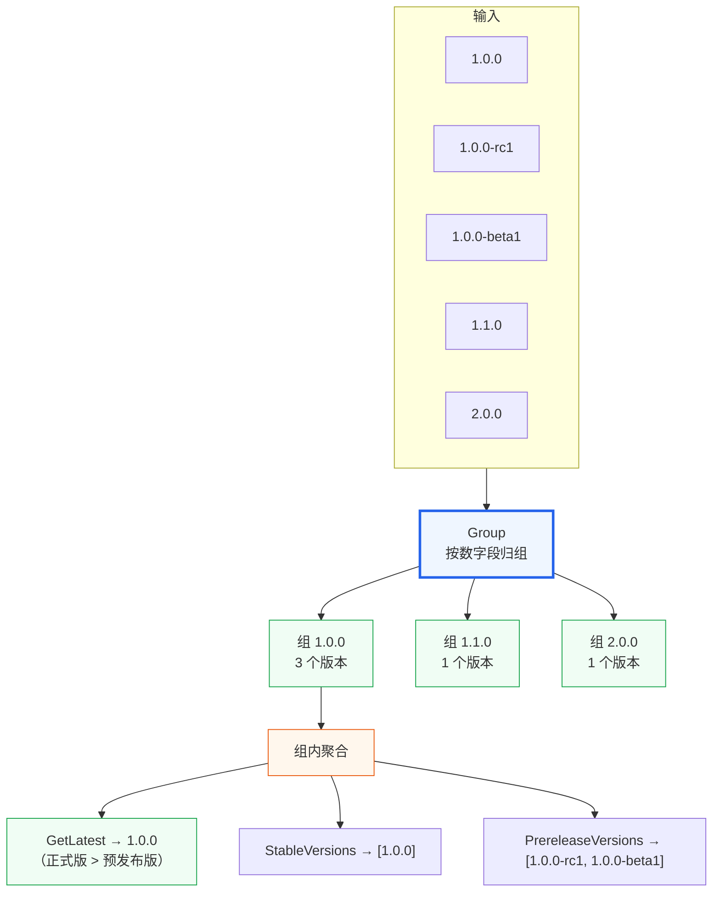

# 分组与聚合

把版本号按**数字部分**归组：数字段完全相同的版本归入同一组（后缀不影响分组）。



## 🗃 简单分组

```go
vs := versions.NewVersions(
	"1.0.0", "1.0.0-rc1", "1.0.0-beta1",  // 数字段都是 [1,0,0] → 同组 "1.0.0"
	"1.1.0",                                // [1,1,0] → 组 "1.1.0"
	"2.0.0",                                // [2,0,0] → 组 "2.0.0"
)

groups := versions.Group(vs) // map[string]*VersionGroup

for id, g := range groups {
	fmt.Printf("%s: %d 个版本，最新 %s\n", id, g.Count(), g.GetLatest().Raw)
}
// 1.0.0: 3 个版本，最新 1.0.0（正式版 > 预发布版）
// 1.1.0: 1 个版本，最新 1.1.0
// 2.0.0: 1 个版本，最新 2.0.0
```

分组 ID = `BuildGroupID()`，把数字段点号**全部拼接**（`[1,0,0]` → `"1.0.0"`）。详见 [分组语义](/concepts/grouping)。

::: tip 数字段相同才同组
`1.0.0` 与 `1.0.1` 数字段不同（`[1,0,0]` vs `[1,0,1]`），是**不同分组**。只有 `1.0.0` 与 `1.0.0-rc1` 这种数字段相同、仅后缀不同的版本才归同组。
:::

## 📊 组内聚合

```go
g := groups["1.0.0"]
g.GetLatest().Raw        // 1.0.0（正式版最新）
g.GetOldest().Raw        // 1.0.0-beta1（beta < rc < 正式）
g.LatestStable().Raw     // 1.0.0
g.LatestPrerelease().Raw // 1.0.0-rc1
g.StableVersions()       // [1.0.0]
g.PrereleaseVersions()   // [1.0.0-beta1, 1.0.0-rc1]
```

## ⚡ 有序索引（范围查询）

当版本量大、需多次范围查询时，用 `SortedVersionGroups` 一次构建、多次查询：

```go
svg := versions.NewSortedVersionGroups(vs)

svg.GroupIDs() // ["1.0" "1.1" "2.0"] 已排序
svg.Contains("1.1") // true

// 范围查询：取 1.0 ~ 2.0 之间的版本
// QueryRange 接受 *tuple.Tuple2[*Version, ContainsPolicy] 作为起止端点
inRange := svg.QueryRange(start, end)
```

端点 `*tuple.Tuple2[*Version, ContainsPolicy]` 来自 `github.com/golang-infrastructure/go-tuple`，详见 [`QueryRange`](/sdk/api/query-range-sortedversiongroups) 与 [范围与包含策略](/concepts/range-and-policy)。

## 🚀 下一步

- [约束表达式实战](/tutorials/constraints-in-practice)
- API：[`Group`](/sdk/api/group) · [`VersionGroup`](/sdk/api/version-group) · [`SortedVersionGroups`](/sdk/api/sorted-version-groups) · [`GroupByMajor`](/sdk/api/group-by-major)
- CLI：[`group`](/cli/commands/group) · [`group-latest`](/cli/commands/group-latest)
