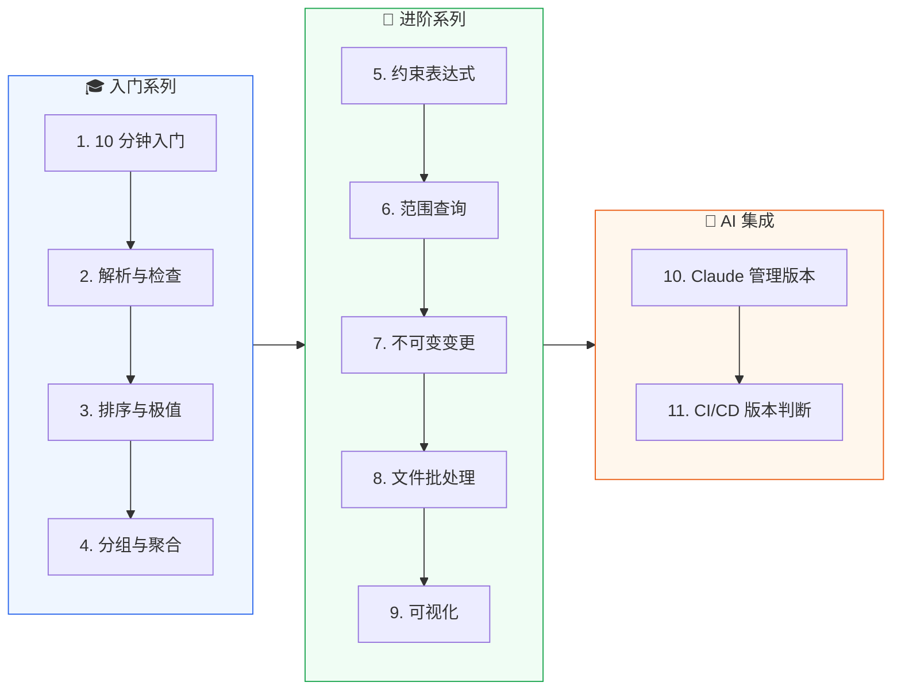

# 教程

通过动手实践学习 versions-skills。每篇教程都是可运行的完整示例。

## 🎓 入门系列

1. [10 分钟入门](/tutorials/getting-started) — 从解析到比较，跑通第一个程序
2. [解析与检查](/tutorials/parse-and-check) — 拆解版本号、判断类型
3. [排序与极值](/tutorials/sort-and-minmax) — 给版本列表排序、找最新/最旧
4. [分组与聚合](/tutorials/grouping) — 按主次版本号归组、组内聚合

## 🚀 进阶系列

5. [约束表达式实战](/tutorials/constraints-in-practice) — 依赖兼容性判断
6. [范围查询](/tutorials/range-query) — 区间过滤与包含策略
7. [不可变变更与发布流程](/tutorials/bump-and-release) — bump / with 链式构造
8. [文件批处理](/tutorials/file-batch) — 读取、去重、排序、写回
9. [可视化与报告](/tutorials/visualization) — 文本树状图

## 🤖 AI 集成系列

10. [让 Claude 管理版本](/tutorials/ai-version-management) — MCP 接入 + 提示词
11. [CI/CD 中的版本判断](/tutorials/ci-cd) — CLI 在 GitHub Actions 的用法

::: tip 可运行示例
仓库 `examples/` 目录有 7 个完整 Go 示例（`00_quick_start` ~ `06_version_visualization`），可直接 `go run`。
:::
