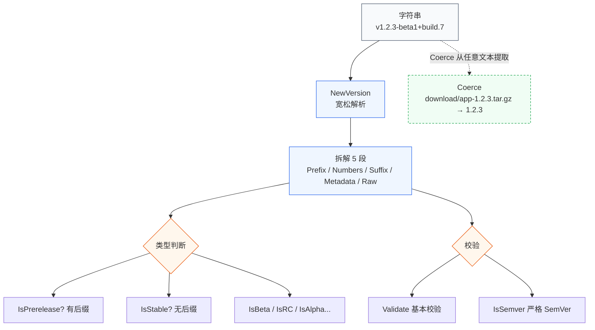

# 解析与检查

深入解析版本号字符串，提取各组成部分，并判断版本类型。



## 🧱 拆解结构

```go
v := versions.NewVersion("v1.2.3-beta1+build.7")

fmt.Println(v.Prefix)         // v
fmt.Println(v.VersionNumbers) // [1 2 3]
fmt.Println(v.Suffix)         // -beta1
fmt.Println(v.Metadata)       // build.7
fmt.Println(v.Segments())     // [1 2 3]
fmt.Println(v.SubVersion())   // 1（后缀里的子版本号）
```

字段语义见 [版本号结构](/concepts/version-anatomy)。

## 🏷 类型判断

`Version` 提供一族 `Is*` 谓词：

```go
v := versions.NewVersion("1.0.0-beta2")

v.IsStable()      // false
v.IsPrerelease()  // true
v.IsBeta()        // true
v.IsAlpha()       // false
v.IsRC()          // false
v.PreReleaseType() // "beta"
v.SuffixWeight()  // 200 (SuffixWeightBeta)
```

完整谓词见 [谓词方法索引](/sdk/predicates)。

## ✅ 校验

```go
v, _ := versions.NewVersionE("not-a-version")
fmt.Println(v.IsValid()) // false

err := v.Validate()      // ErrVersionInvalid
err = v.ValidateSemver() // 严格 SemVer 校验
```

## 🎯 从文本提取（Coerce）

```go
v := versions.Coerce("download/app-1.2.3-linux-amd64.tar.gz")
fmt.Println(v.Raw) // 1.2.3
```

`Coerce` 在任意字符串中找第一个版本号模式子串。

## 🚀 下一步

- [排序与极值](/tutorials/sort-and-minmax)
- 概念：[后缀权重](/concepts/suffix-weight) · [SemVer](/concepts/semver)
- API：[`Version`](/sdk/api/version) · [`Coerce`](/sdk/api/coerce)
