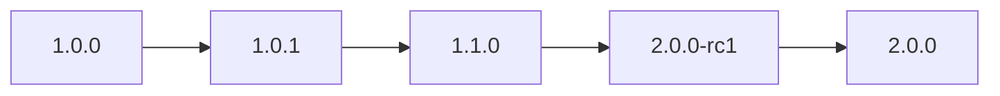

# 可视化与报告

把版本号列表渲染成文本树状图，便于理解层级关系。

:::mermaid
flowchart LR
  IN["扁平版本列表<br/>1.0.0 / 1.0.1 / 1.1.0<br/>2.0.0-rc1 / 2.0.0"]
  IN --> VIS["Visualize<br/>按数字段分层"]
  VIS --> TREE["🌳 文本树<br/>1<br/>├─0<br/>│ ├─0<br/>│ └─1<br/>└─1<br/>2<br/>├─0-rc1<br/>└─0"]
  IN -.->|"分组后"| GROUP["分组可视化<br/>按组聚合展示"]
  IN -.->|"限制每组数量"| LIMIT["max_items_per_group"]

  style IN fill:#f8fafc,stroke:#475569
  style VIS fill:#eff6ff,stroke:#2563eb
  style TREE fill:#f0fdf4,stroke:#16a34a,stroke-width:3px
  style GROUP fill:#fff7ed,stroke:#ea580c,stroke-dasharray:4 3
  style LIMIT fill:#fff7ed,stroke:#ea580c,stroke-dasharray:4 3
:::

## 🌳 版本列表可视化

```go
vs := versions.NewVersions("1.0.0", "1.0.1", "1.1.0", "2.0.0-rc1", "2.0.0")
versions.VisualizeVersions(vs, os.Stdout, 0)
```

输出层级树状图（默认 `maxItems=0` 不限每组数量）。

## 🗂 分组可视化

```go
versions.VisualizeVersionGroups(vs, os.Stdout)
```

按分组渲染摘要树，每组显示其下的版本。

## 🎚 限制每组数量

```go
// 每组最多显示 3 个版本
versions.VisualizeVersions(vs, os.Stdout, 3)
```

## 🤖 CLI

```bash
versions visualize 1.0.0 1.0.1 1.1.0 2.0.0-rc1 2.0.0
versions visualize --groups --from-file releases.txt
versions visualize --max-items 5 --from-file releases.txt
```

## 📊 Mermaid 图表

文档站内置 Mermaid 支持。除了文本树，你还可以在 Markdown 里画版本演进图：



## 🚀 下一步

- [让 Claude 管理版本](/tutorials/ai-version-management)
- API：[`VisualizeVersions`](/sdk/api/visualize-versions) · [`VisualizeVersionGroups`](/sdk/api/visualize-version-groups)
- CLI：[`visualize`](/cli/commands/visualize)
