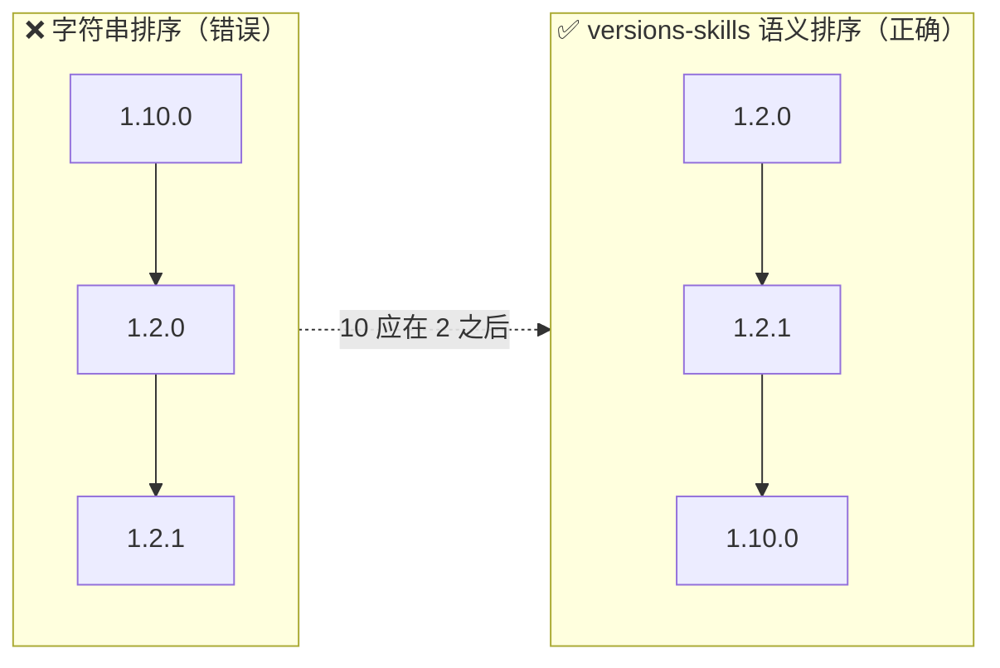

# 为什么需要 versions-skills

## 版本号是个"看起来像数字的字符串"

每个工程团队迟早都会撞上同一类 bug：

```python
sorted(["1.2.0", "1.10.0", "1.2.1"]) == ["1.10.0", "1.2.0", "1.2.1"]   # 字典序，错了
```

字符串排序把 `"1.10.0"` 排在 `"1.2.0"` **前面**，因为 `'1' < '2'` 是逐字符比较的。在依赖解析、发布流水线、安全补丁筛选里，这种错误会把"最新版本"选错，后果从构建失败到引入漏洞不等。



## 问题不止"排序"

版本号处理的真正难点，是它表面上像数字、实际上承载了一整套**发布语义**：

| 问题 | 陷阱 | 例子 |
|:--|:--|:--|
| 排序 | 字典序 vs 数值序 | `1.10.0` 应在 `1.2.0` 之后 |
| 预发布顺序 | `1.0.0-rc1` 和 `1.0.0` 谁新？ | `1.0.0-rc1` < `1.0.0`（rc 早于正式版） |
| 后缀梯队 | alpha/beta/rc/milestone 的先后 | `dev < snapshot < nightly < alpha < beta < milestone < rc < 正式版 < sp < patch < post` |
| 约束表达式 | `^1.2.3` 允许哪些版本？ | `>=1.2.3, <2.0.0`，但 `^0.2.3` 是 `>=0.2.3, <0.3.0` |
| 范围查询 | 边界含不含？ | `[1.0.0, 2.0.0)` 与 `(1.0.0, 2.0.0]` 含义不同 |
| 格式多样性 | Maven 的 `0.9.0+121-bcc5decc`、PEP 440 的 `1.0.0.post1` | 不是所有版本都遵循 semver |
| 从文本提取 | `program-1.2.3-linux-amd64` | 需要从中"认出"版本号 |

每个问题单独看都不难，合在一起就是一片正则与 if-else 的沼泽。**手写规则必踩坑**，因为生态太多（semver、Maven、PEP 440、Debian、CalVer……），边界情况无穷。

### 预发布版本的梯队

光"谁先谁后"这一项，真实发布阶梯是这样的——而不是字典序里 `alpha < beta < rc` 凑巧对了的那种"对":

```mermaid
flowchart LR
  dev["dev<br/>(50)"] --> snapshot["snapshot<br/>(60)"] --> nightly["nightly<br/>(70)"]
  nightly --> alpha["alpha<br/>(100)"] --> beta["beta<br/>(200)"] --> milestone["milestone<br/>(300)"]
  milestone --> rc["rc<br/>(400)"] --> stable["✅ 正式版<br/>(无后缀)"]
  stable --> sp["sp<br/>(600)"] --> patch["patch<br/>(700)"] --> post["post<br/>(800)"]
  style dev fill:#fef2f2,stroke:#dc2626
  style alpha fill:#fff7ed,stroke:#ea580c
  style beta fill:#fff7ed,stroke:#ea580c
  style rc fill:#fef9c3,stroke:#ca8a04
  style stable fill:#f0fdf4,stroke:#16a34a,stroke-width:3px
  style post fill:#eff6ff,stroke:#2563eb
```



## 现有方案缺什么

| 方案 | 局限 |
|:--|:--|
| 字符串 `sort` | 数值序错误 |
| 正则提取 | 漏掉 Maven/Scala 风格，后缀语义丢失 |
| `semver` 库 | 只认严格 semver，`v1.2.3`、`1.2`、`1.0.0-ga` 都不认 |
| 手写比较函数 | 每个团队重造一遍轮子，后缀权重表抄错就错 |
| AI Agent 自己推理 | LLM 会把 `1.10.0 < 1.2.0` 当对，因为它"看起来"对 |

最后一行尤其关键：**AI Agent 没有可靠的版本号直觉**。让 LLM 直接判断版本关系，它会用字符串直觉给出错误答案，而且很自信。这正是 versions-skills 存在的理由。

## versions-skills 的答案

**把版本号的语义内置成一套可被 AI 直接调用的能力。**

- 一套**宽口径解析器**：semver、带前缀、预发布、Maven/Scala/PEP 440 风格全收，还能从任意字符串 Coerce 出版本号。
- 一套**语义化比较引擎**：四级优先级（数字段 → 后缀权重 → 发布时间 → 原始串），按真实发布阶梯排序，不是字典序。
- 一套**完整约束语法**：npm 风格 `^`/`~`/`1.x`/`||`，与 pip/npm 语义对齐。
- **三种交付形态共享同一引擎**：Claude Code Skills（领域知识 + 斜杠命令）、MCP Server（21 个工具，任何 MCP 客户端可调）、Go SDK / CLI（程序与脚本）。

这样 AI Agent 不再靠"直觉"猜版本关系，而是调用一个**确定性、可验证**的工具拿到正确答案。

## 谁会用它

- **在 AI Agent 里做依赖管理**：让 Claude Code / Codex 判断升级是否安全、筛选兼容版本。
- **CI/CD 流水线**：从 `versions.txt` 或构建产物里提取版本、排序、找最新稳定版。
- **安全运营**：给定一个补丁版本范围，快速筛选受影响的已发布版本。
- **Go 应用内嵌**：作为库直接用于版本号字段的解析、存储（SQL Scanner/Valuer）、比较。

→ 接下来看 [工作原理](./how-it-works) 了解四层架构，或 [一键提示词](./prompts) 直接开始。
